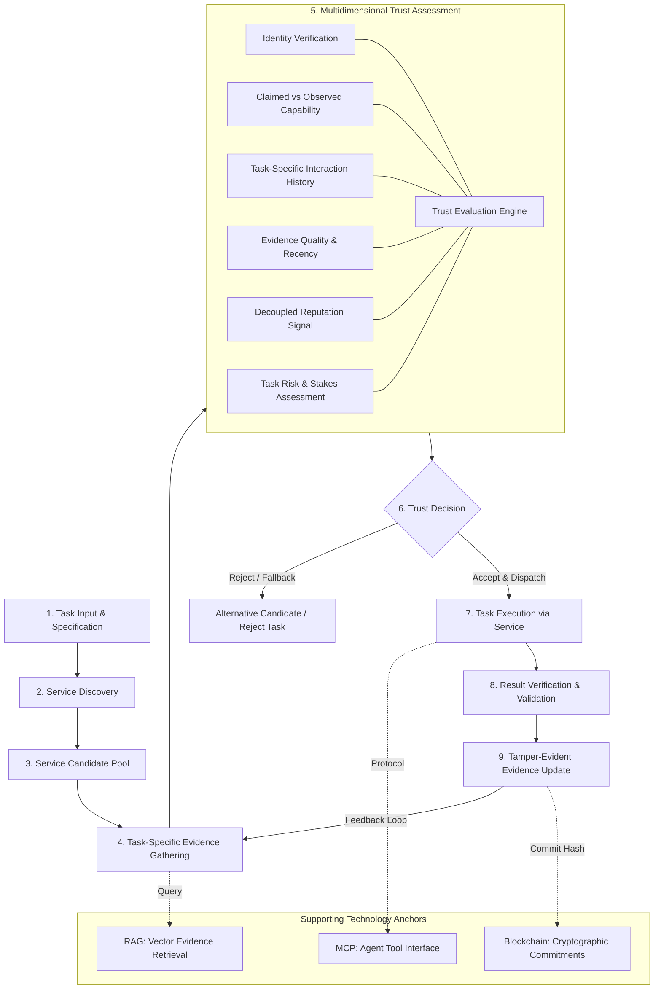
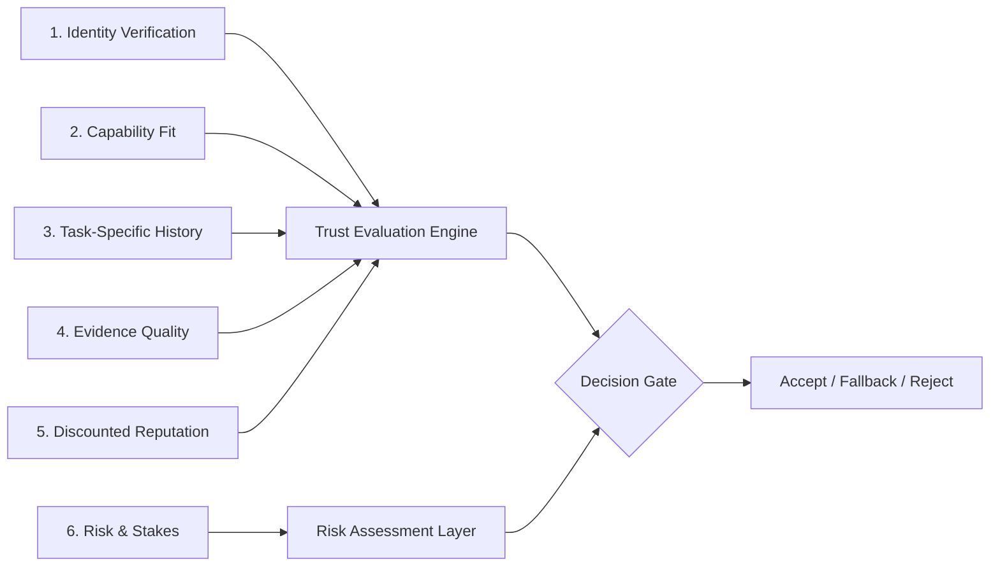

# Trust-Aware Service Selection for Autonomous AI Agents

### *An Evidence-Based Trust and Verification Framework*

[](#current-project-status)
[](LICENSE)
[](#prerequisites)
[](#architecture-overview)
[](#experimental-design)

---

## 1. Executive Summary

As autonomous AI agents shift from isolated reasoning engines into open, decentralized multi-agent ecosystems, they must autonomously delegate tasks to external service agents (e.g., specialized code execution, data retrieval, mathematical verification, financial querying). However, open service marketplaces are vulnerable to performance degradation, misleading capability claims, and coordinated Sybil manipulation. Current agent architectures rely either on arbitrary service selection or on global, aggregate reputation scores that are easily gamed and blind to task context. **This project introduces a task-specific, evidence-grounded trust and verification framework that enables autonomous AI agents to evaluate, select, verify, and update trust assessments of external service providers based on verifiable historical interaction evidence rather than reputation alone.**

---

## 2. Central Research Question

> **“Can task-specific, verifiable evidence improve autonomous AI-agent service selection compared with reputation-only scoring?”**

### Key Sub-Questions
1. How does conditioning trust decisions on **semantic task similarity** alter malicious-agent selection rates compared to global aggregate reputation?
2. To what extent does **post-execution verification feedback** prevent performance drift and collusive reputation laundering?
3. What is the computational and latency trade-off incurred by combining vector-based evidence retrieval (RAG) and cryptographic state commitments?

---

## 3. Problem Statement

In decentralized or open agent networks, autonomous client agents must select candidate service agents under deep uncertainty:
- **Asymmetric Information:** Service providers publish self-declared capability profiles that cannot be verified prior to invocation.
- **Vulnerability to Sybil and Collusive Inflation:** Bad actors create hundreds of ephemeral virtual identities to exchange artificial positive feedback, artificially inflating global reputation scores at minimal economic cost.
- **Domain Mismatch (Halo Effect):** A service agent with a stellar reputation for generic document summarization may catastrophically fail or introduce security vulnerabilities when assigned complex mathematical proofs or sensitive API integrations.
- **Dynamic Behavioral Drift:** Agents that behave reliably during initial evaluation periods may subsequently degrade, experience intermittent timeouts, or execute exit scams on high-stakes tasks.

---

## 4. Why This Problem Matters

Multi-agent autonomous systems cannot achieve production deployment in mission-critical, enterprise, or financial contexts if delegation is brittle or exploitable:
- **Cascade of Failure:** In composite multi-agent workflows, a single compromised or faulty external tool creates cascading hallucinations that corrupt downstream reasoning steps.
- **Resource Depletion:** Invoking non-functional or stalling endpoints wastes execution budgets, tokens, and wall-clock latency.
- **Empirical Fragility:** Real-world deployments of decentralized agent registries demonstrate that without verifiable task grounding, public agent markets suffer near-total market failure.

---

## 5. Research Gap

| Prior Research Domain | Primary Mechanism | Critical Vulnerability / Gap Addressed by This Work |
|---|---|---|
| **Decentralized Agent Registries (e.g., ERC-8004)** | Global, on-chain feedback registries and agent cards. | Highly vulnerable to coordinated Sybil reviews (up to 90.6% observed) and endpoint unreachability; feedback is not tied to verified task execution proofs. |
| **Multi-Agent Reputation (e.g., Beta Reputation, REGRET)** | Statistical aggregation of peer ratings across interactions. | Treats reputation as a monolithic scalar; ignores task-specific capability alignment and semantic task similarity. |
| **Trustworthy RAG Systems** | Semantic grounding of LLM generation against document corpora. | Applied almost exclusively to text generation rather than multi-agent service discovery, tool invocation, and trust modeling. |
| **Cryptographic Provenance** | Hash chains, Merkle trees, and transparency logs. | Cryptography guarantees data immutability, but immutability alone does not verify whether an agent executed a task correctly. |

**The Gap:** A disciplined, controlled framework that synthesizes **task-specific historical interaction retrieval**, **rigorous post-execution verification**, and **tamper-evident provenance commitments** to govern autonomous service selection.

---

## 6. Proposed Solution

We propose a multi-layered trust evaluation architecture wherein service selection decisions are made by an autonomous client agent using a six-dimensional evaluation framework:

$$\text{Trust Decision} = \mathcal{F}(\text{Identity}, \text{Capability}, \text{Task-Specific History}, \text{Evidence Quality}, \text{Reputation}, \text{Risk})$$

Rather than relying on reputation as the sole decision variable, our system treats reputation as merely one discounted prior signal, prioritizing **verifiable interaction evidence specific to the requested task domain**.

---

## 7. Architecture Overview

The system design enforces a strict separation of concerns across discovery, assessment, selection, execution, and verification:



---

## 8. Core Workflow

The end-to-end operational lifecycle follows an 8-step closed feedback loop:

1. **Task Ingestion & Risk Scoring:** The client agent receives a goal, extracts the required domain capabilities, and assigns an objective risk tier (Low, Medium, High, Critical).
2. **Service Discovery:** The agent queries local registries or open directory protocols to locate candidate service providers matching the schema interface.
3. **Evidence Retrieval (RAG):** For each candidate, the agent queries its private and shared evidence store via semantic search, retrieving historical records matching the specific task type.
4. **Multi-Factor Trust Assessment:** The Trust Engine evaluates identity validity, capability match, verified success rates on similar tasks, evidence recency, and discounted global reputation against the task's risk threshold.
5. **Selection Gate:** If one or more candidates satisfy the confidence threshold for the risk tier, the optimal service is selected; otherwise, the task is safely rejected or escalated.
6. **Task Dispatch (MCP):** The client agent dispatches execution using standardized Model Context Protocol (MCP) tool bindings.
7. **Result Verification:** The output is routed through a verification module (deterministic testing, consensus checks, or schema validation).
8. **Evidence Anchoring:** The execution metadata, observed latency, and verification outcome are stored locally, indexed in the vector store, and cryptographically anchored (SHA-256 state commitment) to ensure tamper-evidence.

---

## 9. Trust Evaluation Factors

The framework evaluates candidate services using six explicit, non-overlapping dimensions:



1. **Identity:** Cryptographic verification of public keys, decentralized identifiers (DIDs), or registration validity.
2. **Capability:** Match between claimed service interfaces and observed input/output schemas.
3. **Task-Specific History:** Empirical success and failure rates recorded exclusively for tasks within the same semantic domain.
4. **Evidence Quality:** Recency of observations, sample size, verification rigor (e.g., deterministic vs. heuristic), and provenance strength.
5. **Reputation (Discounted):** Third-party or network-wide ratings, discounted to counteract potential Sybil inflation.
6. **Risk & Stakes:** Irreversibility, latency constraints, and potential blast radius of service failure.

---

## 10. Experimental Design

To empirically evaluate the framework, we specify a controlled, reproducible simulation testbed consisting of **30 simulated service agents**:

```text
Total Service Agent Population (N = 30):
├── 20 Reliable Services   (Consistently correct execution, low latency, 95%+ success rate)
├──  5 Unreliable Services (Intermittent faults, high latency variance, stochastic timeouts)
└──  5 Malicious Services  (Adversarial behavior: deceptive outputs, Sybil collusion, silent failure)
```

### Three Comparative Selection Strategies
1. **Random Selection (Null Baseline):** Selects uniformly at random from candidates matching the required capability schema.
2. **Reputation-Only Selection (Industry Baseline):** Selects candidates using aggregate historical ratings (replicating standard decentralized registry mechanisms such as ERC-8004).
3. **Evidence-Based Selection (Proposed Framework):** Selects candidates using task-specific verified interaction history, evidence quality filtering, and risk-weighted confidence thresholds.

---

## 11. Evaluation Metrics

The experimental protocol measures performance across five formalized metrics:

| Metric | Symbol | Definition / Objective | Desirable Direction |
|---|---|---|---|
| **Task Success Rate** | $TSR$ | $\frac{\text{Successfully Verified Tasks}}{\text{Total Assigned Tasks}}$ | $\uparrow$ Higher is better |
| **Malicious-Agent Selection Rate** | $MASR$ | $\frac{\text{Selections of Malicious Agents}}{\text{Total Selection Decisions}}$ | $\downarrow$ Lower is better |
| **False Rejection Rate** | $FRR$ | $\frac{\text{Reliable Services Incorrectly Rejected}}{\text{Total Reliable Opportunities}}$ | $\downarrow$ Lower is better |
| **Verification Cost Overhead** | $VCO$ | Computational and latency expenditure incurred by result verification | $\downarrow$ Lower is better |
| **Selection Decision Latency** | $SDL$ | Wall-clock time (ms) required to query evidence and compute trust | $\downarrow$ Lower is better |

*Note: No experimental values are reported until reproducible runs are executed in the simulation environment.*

---

## 12. Technology Roles & Architectural Separation

Each supporting technology in the stack addresses a specific architectural requirement. None is used as a generic buzzword:

```text
┌──────────────────────────────────────────────────────────────────────────────┐
│  RAG (Retrieval-Augmented Generation)                                        │
│  Role: Semantic retrieval of historical interaction records matching the     │
│        current task's domain and embedding context.                          │
│  Solves: Cold-start search over multi-thousand interaction history logs.     │
│  Does NOT solve: Verifying whether the retrieved evidence was truthful.      │
├──────────────────────────────────────────────────────────────────────────────┤
│  MCP (Model Context Protocol)                                                │
│  Role: Standardized, vendor-neutral tool interface exposing trust,           │
│        verification, and execution endpoints to the client LLM.              │
│  Solves: Interoperability across heterogeneous local and remote agents.      │
│  Does NOT solve: Trust evaluation or adversarial behavior detection.         │
├──────────────────────────────────────────────────────────────────────────────┤
│  Blockchain / Decentralized Ledger                                           │
│  Role: Cryptographic timestamping, Merkle root state commitments, and        │
│        tamper-evident audit logs of interaction hashes.                      │
│  Solves: Post-hoc alteration or deletion of negative performance history.   │
│  Does NOT solve: Verification of execution quality or output correctness.    │
├──────────────────────────────────────────────────────────────────────────────┤
│  x402 (HTTP 402 Autonomous Payments)                                         │
│  Role: [FUTURE EXTENSION] Risk-conditioned, programmatic micropayments upon  │
│        verified task completion.                                             │
│  Status: Scoped for Phase 10 / Future Work (Not in current core pipeline).   │
└──────────────────────────────────────────────────────────────────────────────┘
```

---

## 13. Research Basis & Existing Evidence

Our problem formulation is directly supported by empirical findings in recent academic literature:

> **EXISTING RESEARCH EVIDENCE**  
> **Source:** Xiong, X., Li, Z., Wei, W., Wang, Q., Knottenbelt, W. J., & Wang, Z. (2026). *“Can Trustless Agents Be Trusted? An Empirical Study of the ERC-8004 Decentralized AI Agent Ecosystem.”* arXiv:2606.26028.
>
> In the first empirical study of the ERC-8004 standard across Ethereum, BNB Smart Chain (BSC), and Base:
> - **Endpoint Availability:** Only **3% (Ethereum)**, **4% (BSC)**, and **15% (Base)** of registered agents possessed a valid registration file with at least one reachable, live service endpoint.
> - **Sybil Reviewers:** Coordinated Sybil reviewer behavior accounted for **73.5% (Ethereum)**, **59.2% (BSC)**, and **90.6% (Base)** of all registered feedback accounts.
> - **Reputation Collapse:** Upon removing Sybil-coordinated feedback, the pool of usable ratings collapsed, rendering global reputation signals largely non-functional for reliable autonomous delegation.

This project uses these empirical findings as formal motivation for why reputation-only selection fails and why task-specific, verifiable evidence is essential.

---

## 14. Current Project Status

| Area | Status | Notes |
|---|---|---|
| **Research Question & Framing** | `COMPLETE` | Rigorously scoped; verified against existing literature. |
| **System Architecture & C4 Models** | `COMPLETE` | 10 modular components specified with strict data boundaries. |
| **Mathematical Trust & Evidence Models** | `PROPOSED` | Formally specified; weights to be calibrated empirically. |
| **Threat & Security Modeling** | `COMPLETE` | 14 adversarial threats analyzed with mitigation boundaries. |
| **Codebase Scaffolding (`src/`)** | `IMPLEMENTED` | Pydantic data models, modular simulation engine, test suites. |
| **Controlled Experimentation** | `READY TO RUN` | 30-agent population, 3 strategies, deterministic task generator. |
| **Experimental Results** | `NOT YET RUN` | Result schemas documented; no fabricated data reported. |
| **x402 Payment Integration** | `FUTURE WORK` | Intentionally excluded from core trust-selection boundary. |

---

## 15. Strategic Roadmap

```text
Phase 1: Research Framing & Literature Analysis       [DONE]
Phase 2: Formal System & Threat Modeling             [DONE]
Phase 3: Modular Simulation Engine Scaffolding       [DONE]
Phase 4: Multi-Dimensional Trust & Evidence Engine    [DONE]
Phase 5: Baseline Selection Strategies Implementation [DONE]
Phase 6: Verification & Feedback Pipeline             [DONE]
Phase 7: Controlled Experiment Execution (30 Agents)  [NEXT]
Phase 8: Statistical Analysis & Metric Visualization  [PLANNED]
Phase 9: MCP Protocol & Live Registry Adapter         [PLANNED]
Phase 10: x402 Micropayment & Settlement Integration  [FUTURE WORK]
```

---

## 16. Repository Structure

```text
.
├── README.md                           # Master research overview & documentation gateway
├── LICENSE                             # MIT Open Source License
├── CONTRIBUTING.md                     # Academic & engineering contribution guide
├── CODE_OF_CONDUCT.md                  # Contributor Covenant standard
├── SECURITY.md                         # Responsible disclosure & agent security policy
├── CHANGELOG.md                        # Version progression & milestone tracking
├── project.yaml                        # Machine-readable experiment parameters
├── .env.example                        # Template environment variables (no secrets)
├── .gitignore                          # Exclusions for Python, IDEs, and run artifacts
│
├── .github/                            # Issue templates and pull request standards
│   ├── pull_request_template.md
│   └── ISSUE_TEMPLATE/
│       ├── bug_report.md
│       ├── feature_request.md
│       └── research_inquiry.md
│
├── docs/                               # Authoritative documentation tree
│   ├── README.md                       # Documentation index & reading paths
│   ├── 01-overview/                    # Problem, research question, objectives, scope, terminology
│   ├── 02-research/                    # Literature review, research gap, existing evidence, novelty
│   ├── 03-system-design/               # Architecture, trust model, evidence model, threat/security
│   ├── 04-experiment/                  # Experimental design, 30 agents, metrics, protocol, results schema
│   ├── 05-implementation/              # Implementation plan, module breakdown, APIs, MCP, RAG, tests
│   ├── 06-presentation/                # Team handbook, pitches, 50+ judge Q&As, 20 hard questions
│   ├── 07-poster/                      # Poster content, layout, evidence mapping, presentation script
│   └── 08-roadmap/                     # Current status, milestones, and future extensions
│
├── diagrams/                           # Mermaid diagram source files (.mmd)
│   ├── architecture/                   # High-level, system context, trust evaluation, deployment
│   ├── data-flow/                      # Evidence lifecycle, end-to-end data flow
│   ├── sequence/                       # Service selection & verification sequence
│   ├── experiment/                     # Methodology, research logic traceability
│   ├── threat-model/                   # Adversarial threat boundaries
│   └── poster/                         # Poster block architecture
│
├── research/                           # Academic papers, notes, and bibliography
│   ├── bibliography/                   # BibTeX and citation files
│   ├── evidence/                       # Summaries of external empirical studies
│   ├── notes/                          # Research design working notes
│   ├── papers/                         # Literature summaries
│   └── references.bib                  # Master BibTeX reference file
│
├── experiments/                        # Experiment configurations, scenarios, and runs
│   ├── configs/                        # YAML configuration files for simulation runs
│   ├── datasets/                       # Benchmark task definitions
│   ├── scenarios/                      # Agent population configurations (20/5/5)
│   ├── scripts/                        # Experiment execution scripts
│   ├── runs/                           # Raw experiment run output logs [EMPTY]
│   └── results/                        # Processed metrics & visualization data [EMPTY]
│
├── src/                                # Core Python implementation & simulation package
│   ├── __init__.py
│   ├── data_models.py                  # Pydantic schemas (Agent, Task, Evidence, TrustAssessment, etc.)
│   ├── agent/                          # Autonomous client agent execution loop
│   ├── services/                       # Simulated service providers (Reliable, Unreliable, Malicious)
│   ├── trust/                          # Multidimensional trust evaluation engine
│   ├── evidence/                       # Evidence store, extraction, and lifecycle management
│   ├── selection/                      # Selection strategies (Random, Reputation, Evidence-based)
│   ├── verification/                   # Result verification and validation layer
│   ├── rag/                            # Vector retrieval for historical interaction evidence
│   ├── mcp/                            # Model Context Protocol tool interfaces
│   ├── blockchain/                     # Tamper-evident commitment and provenance anchor interface
│   └── experiment/                     # Experiment orchestrator and metric evaluation harness
│
├── tests/                              # Comprehensive test suite
│   ├── unit/                           # Unit tests for models, trust engine, selection, verification
│   ├── integration/                    # Pipeline integration tests
│   ├── system/                         # End-to-end simulated workflow tests
│   └── experiment/                     # Reproducibility and statistical validation tests
│
└── scripts/                            # Operational utility scripts
    ├── setup/                          # Environment setup & dependency checking
    ├── experiment/                     # Simulation launch scripts
    ├── validation/                     # Link integrity & schema validation
    └── documentation/                  # Documentation generation & verification
```

---

## 17. How to Run Locally

### Prerequisites
- Python 3.10 or higher
- Git
- Recommended: Virtual environment (`venv` or `conda`)

### Installation
```bash
# Clone the repository
git clone https://github.com/your-org/trust-aware-agent-service-selection.git
cd trust-aware-agent-service-selection

# Create and activate virtual environment
python -m venv venv
# On Windows:
.\venv\Scripts\activate
# On Linux/macOS:
source venv/bin/activate

# Install dependencies
pip install -r requirements.txt
```

### Running the Test Suite
```bash
# Run all unit tests
pytest tests/unit/

# Run integration tests
pytest tests/integration/
```

### Running the Simulation Experiment
```bash
# Run a dry simulation with 30 simulated agents across 100 tasks
python -m src.experiment.runner --config experiments/configs/default_simulation.yaml
```

---

## 18. How to Reproduce Experiments

To ensure scientific replicability, all experimental parameters are deterministically seeded:
1. **Configuration:** Scenarios are defined in `experiments/configs/default_simulation.yaml`.
2. **Seed Control:** Random seeds for task generation, agent latency, and failure injection are fixed (`seed: 42`).
3. **Execution:** The experiment runner executes all three selection strategies against identical task sequences and identical agent states.
4. **Output Verification:** Raw telemetry is output to `experiments/runs/` and processed using `src/experiment/metrics.py`.

See the complete [Experiment Reproducibility Guide](docs/04-experiment/reproducibility.md) for step-by-step instructions.

---

## 19. Team Handbook & Presentation Gateway

This repository is designed so that any team member can confidently present the project to judges, researchers, and engineers:

- **Need a quick pitch?** Read the [30-Second Pitch](docs/06-presentation/30-second-pitch.md) or [2-Minute Explanation](docs/06-presentation/2-minute-explanation.md).
- **Need full presentation slides/script?** Read the [5-Minute Presentation Script](docs/06-presentation/5-minute-presentation.md).
- **Presenting to judges?** Study the [50+ Categorized Judge Q&As](docs/06-presentation/judge-questions.md).
- **Facing tough or adversarial questions?** Review the [Top 20 Hard Questions & Defenses](docs/06-presentation/hard-questions.md).
- **Need the full guide?** Read the master [Team Handbook](docs/06-presentation/team-handbook.md).

---

## 20. Research Integrity Statement

Academic integrity is paramount in this work:
- **No Fabricated Benchmarks:** We do not publish synthetic benchmark claims as empirical facts. If an experiment has not been executed, it is explicitly marked `[EXPERIMENT NOT RUN]`.
- **Existing Evidence vs. Project Results:** External empirical studies (e.g., ERC-8004 findings) are explicitly cited under **EXISTING RESEARCH EVIDENCE** and are never conflated with this project's findings.
- **Hypothesis-Driven:** We do not claim our evidence-based framework is universally superior; we formulate testable hypotheses and rigorously measure trade-offs (including verification overhead and decision latency).

---

## 21. Key References

1. **Xiong, X., Li, Z., Wei, W., Wang, Q., Knottenbelt, W. J., & Wang, Z. (2026).** *Can Trustless Agents Be Trusted? An Empirical Study of the ERC-8004 Decentralized AI Agent Ecosystem.* arXiv:2606.26028.
2. **Sabater, J., & Sierra, C. (2002).** *REGRET: A reputation model for multi-agent systems.* Autonomous Agents and Multi-Agent Systems, 5(1), 33-55.
3. **Jøsang, A., & Ismail, R. (2002).** *The beta reputation system.* Proceedings of the 15th Bled Electronic Commerce Conference.
4. **Anthropic. (2024).** *Model Context Protocol (MCP) Specification.* https://modelcontextprotocol.io
5. **Yu, H., Shen, Z., Miao, C., Leung, C., & Niyato, D. (2013).** *A survey of multi-agent trust management systems.* IEEE Access, 1, 35-50.

See [docs/02-research/references.md](docs/02-research/references.md) for the complete annotated bibliography.

---

## 22. License & Contributing

This project is licensed under the [MIT License](LICENSE).  
We welcome academic and open-source contributions. Please read [CONTRIBUTING.md](CONTRIBUTING.md) and adhere to our [Code of Conduct](CODE_OF_CONDUCT.md).
