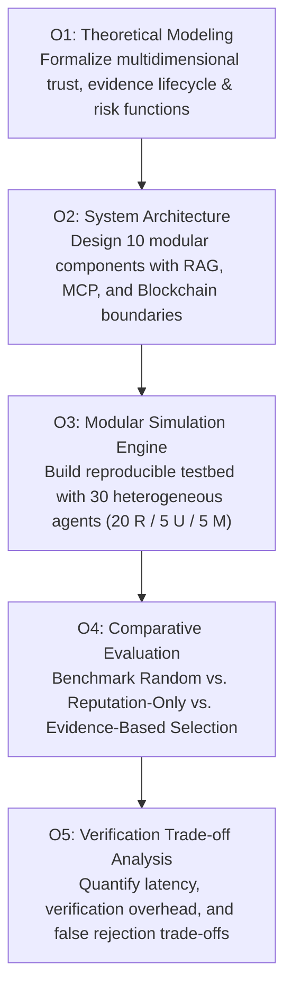

# Project Objectives

## 1. Primary Research Objective

The primary objective of this project is to **design, formalize, and empirically evaluate an evidence-grounded trust framework that enables autonomous AI agents to select external services under uncertainty, demonstrating measurable improvements in task success and resilience against malicious actors compared to reputation-only mechanisms.**

---

## 2. Detailed Technical & Scientific Objectives

### Objective 1: Formal Trust & Evidence Modeling
- Formulate a mathematically sound, non-arbitrary conceptual model integrating **Identity, Capability, Task-Specific History, Evidence Quality, Reputation, and Risk**.
- Define the formal **Evidence Lifecycle**: from task execution and verification to vector indexing and cryptographic state commitment.
- Explicitly separate reputation as an untrusted, discounted prior rather than the final decision authority.

### Objective 2: Clean Architectural Specification
- Design a modular 10-component system architecture with clean separation of concerns.
- Specify exact data contracts and schemas using Pydantic for: `Agent`, `Service`, `Task`, `Capability`, `Evidence`, `VerificationRecord`, and `TrustAssessment`.
- Define vendor-neutral Model Context Protocol (MCP) tool interfaces for agent interactions.
- Establish architectural boundaries for RAG (semantic evidence retrieval) and Blockchain (tamper-evident cryptographic commitment logs).

### Objective 3: Reproducible Simulation Testbed
- Construct a deterministic simulation environment representing a population of **30 heterogeneous service agents**:
  - **20 Reliable Agents:** High availability, schema-compliant, consistent outputs.
  - **5 Unreliable Agents:** Stochastic delays, intermittent timeouts, random degradation.
  - **5 Malicious Agents:** Adversarial prompt manipulation, poisoned outputs, Sybil feedback collusion.
- Implement a workload generator producing deterministic tasks categorized by domain and objective risk tier.

### Objective 4: Rigorous Comparative Benchmarking
- Implement and benchmark three distinct selection strategies:
  1. *Random Selection* (Null baseline)
  2. *Reputation-Only Selection* (ERC-8004 style baseline)
  3. *Evidence-Based Selection* (Proposed framework)
- Measure outcomes across the 5 core evaluation metrics: $TSR$, $MASR$, $FRR$, $VCO$, and $SDL$.
- Prepare statistical significance testing protocols (e.g., Wilcoxon signed-rank tests) to validate whether observed improvements are statistically significant.

### Objective 5: Knowledge Transfer & Documentation Excellence
- Deliver a comprehensive team handbook and presentation assets enabling any team member to present and defend the project before judges, academic researchers, and engineers.
- Maintain absolute research integrity: no fabricated data, no artificial benchmarks, and clear labeling of existing literature vs. project results.
