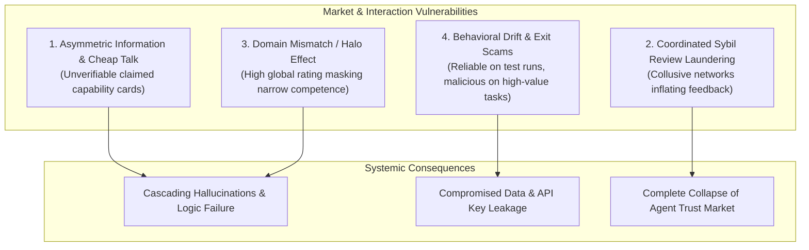

# Problem Statement: The Vulnerability of Autonomous AI Agent Service Selection

## 1. Context: The Emerging Autonomous Agent Economy

Autonomous AI agents are increasingly designed to act as independent decision-makers capable of goal decomposition, tool discovery, and dynamic service invocation. Rather than maintaining massive, monolithic models that attempt to perform every domain-specific task locally, modern agentic architectures favor modular, decentralized service delegation:
- An orchestrator agent discovers external specialized agents (e.g., code execution sandboxes, financial modeling oracles, translation micro-services, mathematical theorem provers).
- Interactions occur peer-to-peer or via standardized protocol abstractions (e.g., Model Context Protocol).

However, autonomous selection in open, unpermissioned networks introduces systemic reliability and security risks that do not exist in closed, human-curated software systems.

---

## 2. Core Failure Modes in Open Agent Ecosystems

### 2.1 Asymmetric Information and "Cheap Talk"
In open service registries, providers publish self-declared capability profiles (e.g., "Agent Cards" or OpenAPI descriptions). Because advertising a capability incurs zero computational or economic penalty, malicious or substandard services routinely make exaggerated claims regarding accuracy, latency, and compliance. An autonomous client agent has no mechanism to determine whether a service can actually satisfy a task prior to invocation.

### 2.2 Coordinated Sybil Manipulation
Decentralized rating systems that aggregate simple user feedback are vulnerable to Sybil attacks. An adversary can spawn thousands of virtual identities at negligible marginal cost and submit mutually reinforcing positive reviews. Empirical research into real-world decentralized registries (specifically the ERC-8004 standard) has demonstrated that **between 59.2% and 90.6% of reviewers engage in coordinated Sybil behavior**. When Sybil feedback is removed, usable reputation data vanishes, proving that raw reputation is an unreliable signal.

### 2.3 Domain Mismatch (The "Halo Effect")
Global reputation scores compress heterogeneous multidimensional performance into a single scalar value. A service provider that reliably completes simple text formatting tasks can accumulate a 4.9/5.0 reputation score. If a client agent delegates a high-stakes SQL sanitization or mathematical optimization task based on this global reputation, the delegation will likely fail because the service's historical reliability does not generalize across domains.

### 2.4 Behavioral Drift, Sloth, and Exit Scams
AI services are dynamic:
- **Model Quantization / Cost Cutting:** Providers may silently swap large foundation models for smaller, quantized variants during high-traffic periods, causing performance degradation.
- **Intermittent Unreliability:** Cloud latency spikes, resource contention, and unhandled exceptions produce stochastic failures.
- **Adversarial Bait-and-Switch:** A service may build a positive reputation on low-stakes benchmark queries, then inject malicious exploits, prompt injections, or data exfiltration payloads once assigned a confidential, high-stakes task.

---

## 3. Why Existing Solutions Are Inadequate

1. **Centralized Whitelists:** Introduce single points of failure, bottleneck innovation, and cannot scale to millions of decentralized micro-agents.
2. **Global Reputation Registries (e.g., ERC-8004 alone):** Suffer from Sybil collapse, lack verification ties to actual task execution, and fail to provide task-specific grounding.
3. **Pure Cryptographic Proofs (e.g., zk-SNARKs for all tasks):** Computationally infeasible for arbitrary natural language tasks and general LLM reasoning loops.

---

## 4. The Need for an Evidence-Based Trust Framework

To safely operate in open multi-agent environments, autonomous AI agents require an evaluation mechanism that:
- Prioritizes **verifiable interaction evidence matching the current task's domain**.
- Validates the **provenance and cryptographic integrity** of historical claims.
- Conditions selection thresholds on **objective task risk and failure impact**.
- Continuously incorporates **post-execution verification feedback** to detect behavioral drift immediately.
