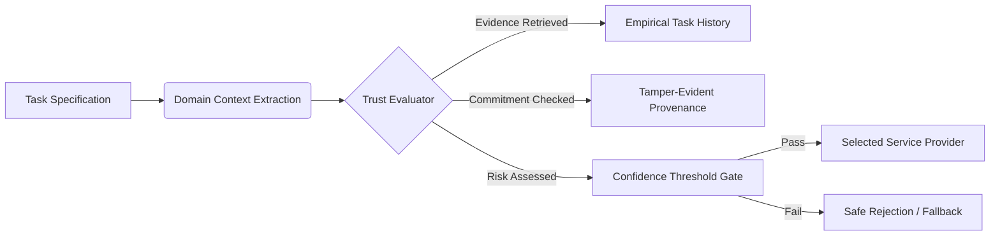

# Project Overview: Trust-Aware Service Selection for Autonomous AI Agents

## 1. Title & Subtitle

**Project Title:** Trust-Aware Service Selection for Autonomous AI Agents  
**Subtitle:** An Evidence-Based Trust and Verification Framework

---

## 2. Executive Summary & Vision

Modern autonomous AI agents (e.g., AutoGPT, BabyAGI, Devin-style coding agents, enterprise workflow orchestrators) are evolving from single, monolithic LLM prompt loops into **decentralized multi-agent economies**. In these architectures, a primary client agent decomposes complex goals into subtasks and dynamically discovers, selects, and invokes external, third-party service agents (e.g., computational solvers, code execution sandboxes, market analysis oracles, specialized domain classifiers).

However, open decentralized agent markets introduce profound security, economic, and reliability vulnerabilities:
- Service agents are autonomous black boxes whose internal model weights, prompts, and training data are opaque.
- Candidate providers publish self-serving capability claims that cannot be trusted prior to execution.
- Classical decentralized reputation systems (e.g., ERC-8004) suffer from coordinated Sybil feedback attacks (accounting for 59% to 90% of reviewers in real-world deployments), rendering aggregate ratings fundamentally fragile.
- General reputation scores fail to account for **task-specific capability**: an agent with a 5-star rating for generic creative writing may fail catastrophically or inject vulnerabilities when executing financial parsing or cryptographic verification.

This project designs, specifies, and implements a **task-specific, evidence-grounded trust and verification framework**. The system enables client agents to replace naive reputation heuristics with a disciplined decision engine that combines **Identity**, **Capability**, **Task-Specific Interaction History**, **Evidence Quality & Recency**, **Discounted Reputation**, and **Risk Assessment**.

---

## 3. The Core Concept: Trust as an Evidence-Grounded Decision

We reject the notion that trust is a permanent, scalar attribute intrinsically possessed by an agent. Instead, we formalize **trust as a dynamic, context-specific decision under risk**:

$$\text{Trust Decision} = \mathcal{D}\Big(\text{Identity}, \text{Capability}, \text{History}_{\text{Task}}, \text{Quality}_{\text{Evidence}}, \text{Reputation}_{\text{Discounted}}, \text{Risk}_{\text{Stakes}}\Big)$$

Rather than treating reputation as the entire decision variable, our framework treats global reputation as merely a low-weight prior signal that is rapidly superseded by **verifiable, empirical interaction evidence matching the specific semantic domain of the requested task**.

---

## 4. What This Project Is NOT

To preserve scientific rigor, it is vital to state explicitly what this project does not claim to be:
- **It is NOT simply "Blockchain + AI":** Blockchain is utilized strictly as an immutable append-only transparency log for cryptographic state commitments (Merkle roots of interaction hashes). It does not solve task verification or make untruthful claims true.
- **It is NOT simply "MCP + AI":** The Model Context Protocol (MCP) provides standard tool-calling transport interfaces, but transport mechanisms provide zero inherent trust, security, or behavioral guarantees.
- **It is NOT simply "x402 + AI":** Autonomous HTTP 402 payment settlement is scoped strictly as a future extension (Phase 10); payments cannot be safely executed until trust and verification are established.
- **It is NOT a generic agent marketplace:** We do not build an eCommerce storefront for AI agents; we construct the algorithmic decision and verification protocol for autonomous client selection.
- **It is NOT a global credit score:** We reject single scalar reputation monopolies in favor of task-conditioned, multi-dimensional trust evaluations.

---

## 5. Architectural Lifecycle Summary

The end-to-end framework operates as a closed-loop verification cycle:
1. **Task Ingestion:** Client agent inspects task inputs, identifies required schemas, and computes stakes.
2. **Discovery:** Identifies registered candidate services.
3. **Evidence Retrieval (RAG):** Queries the local and shared evidence store for historical traces matching the exact task domain.
4. **Multidimensional Assessment:** Evaluates identity proofs, observed failure rates, and evidence recency against the risk gate.
5. **Selection Gate:** Chooses the optimal provider or safely aborts.
6. **Execution (MCP):** Calls the service endpoint with sandboxed inputs.
7. **Result Verification:** Evaluates output correctness using deterministic or consensus validators.
8. **Evidence Anchoring:** Appends the verified outcome to the vector store and anchors state commitments to the blockchain ledger.

---

## 6. Document Navigation

- [Problem Statement](problem-statement.md): In-depth breakdown of failure modes in open agent ecosystems.
- [Research Question](research-question.md): Formal research hypotheses and mathematical questions.
- [Objectives](objectives.md): Primary and secondary milestones.
- [Scope & Boundaries](scope.md): In-scope components vs. out-of-scope technologies.
- [Terminology](terminology.md): Standardized operational definitions.
