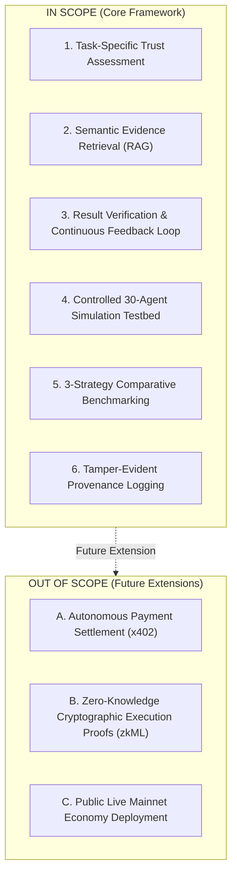

# Research Scope & System Boundaries

To maintain scientific rigor and prevent feature creep, this document formalizes the explicit functional boundaries of the **Trust-Aware Service Selection** project.

---

## 1. Explicit Scope Matrix

| Dimension | In Scope (Current Research Phase) | Out of Scope / Deferred to Future Work |
|---|---|---|
| **Primary Domain** | Autonomous service selection under uncertainty in multi-agent environments. | Human-in-the-loop manual service curation or traditional SaaS procurement. |
| **Trust Model** | Multidimensional evaluation (Identity, Capability, Task-Specific History, Evidence Quality, Reputation, Risk). | Monolithic global scalar credit scores; social network graphs. |
| **Evidence Basis** | Empirical interaction history, deterministic verification outcomes, execution latency, and error logs. | Subjective user opinion surveys, marketing reviews, or unverified self-assertions. |
| **Evaluation Setting** | Controlled, deterministic synthetic simulation with 30 heterogeneous service agents (20 Reliable, 5 Unreliable, 5 Malicious). | Live, uncontrolled public mainnet deployment with real capital at risk. |
| **Supporting Tech: RAG** | Vector retrieval of historical interaction records matching semantic task domains. | Unconstrained LLM text generation or conversational memory. |
| **Supporting Tech: MCP** | Standardized tool bindings exposing verification and trust assessment interfaces. | Proprietary custom agent-to-agent binary communication protocols. |
| **Supporting Tech: Blockchain** | Tamper-evident state commitment logging (SHA-256 Merkle roots of interaction logs). | On-chain execution of LLM models, heavy storage of full JSON logs, or decentralized consensus governance. |
| **Payment Settlement (x402)** | Architectural specification of risk-conditioned payment gates (Phase 10 roadmap). | Real-time on-chain token settlement, cryptocurrency custody, or fiat payment processing. |

---

## 2. In-Scope Focus Areas

1. **Task-Specific Grounding:** Evaluating a candidate agent's competence specifically within the domain of the current task (e.g., Python code execution vs. natural language translation).
2. **Post-Execution Verification:** Validating returned outputs against verifiable criteria (schema validation, unit test execution, or deterministic math checks).
3. **Sybil Resistance:** Defending against coordinated feedback inflation by discounting global reputation in favor of verified interaction records.
4. **Controlled Simulation:** A reproducible 30-agent testbed allowing fair, side-by-side comparison of Random, Reputation-Only, and Evidence-Based selection strategies.

---

## 3. Explicitly Out-of-Scope (and Rationale)

### 3.1 Autonomous Payments (x402)
- **Rationale:** Financial settlement should only occur after trust assessment and verification mechanisms are proven reliable. Incorporating live token payments into the initial prototype introduces unnecessary regulatory, cryptographic, and gas-fee complexities that distract from the primary research question.

### 3.2 Full On-Chain Data Storage
- **Rationale:** Storing multi-kilobyte interaction payloads, logs, and execution traces on a public blockchain is cost-prohibitive and creates privacy violations. Only cryptographic state commitments (hashes) belong on-chain.

### 3.3 Universal zkML (Zero-Knowledge Machine Learning)
- **Rationale:** While cryptographic proofs of model execution are conceptually attractive, zero-knowledge proofs for modern billion-parameter LLMs remain computationally intractable for real-time multi-agent workflows. Our verification model relies on output verification rather than full execution trace proofs.
