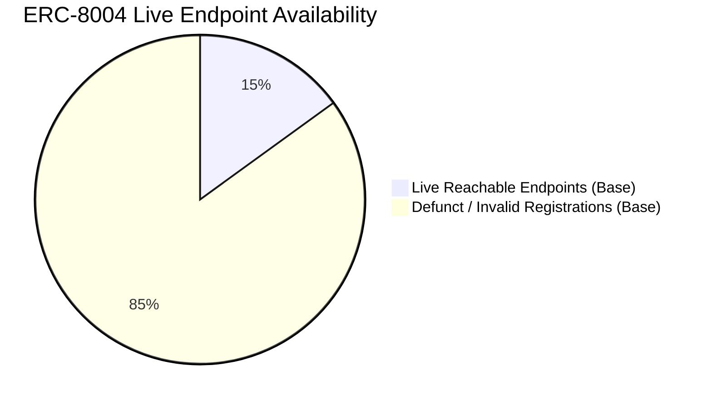

# Existing Research Evidence: Empirical Findings on Decentralized Agent Ecosystems

> **IMPORTANT: RESEARCH INTEGRITY NOTICE**  
> The findings documented below represent **EXISTING RESEARCH EVIDENCE** published in independent academic literature. They are **NOT** experimental results generated by this project. They serve as the empirical motivation for this research framework.

---

## 1. Primary Empirical Anchor: The ERC-8004 Ecosystem Study

**Full Citation:**  
Xiong, X., Li, Z., Wei, W., Wang, Q., Knottenbelt, W. J., & Wang, Z. (2026). *“Can Trustless Agents Be Trusted? An Empirical Study of the ERC-8004 Decentralized AI Agent Ecosystem.”* arXiv:2606.26028 [cs.CR].  
Primary Archive Link: [https://arxiv.org/abs/2606.26028](https://arxiv.org/abs/2606.26028)

### 1.1 Context of the Study
ERC-8004 is an open Ethereum standard proposed to establish a decentralized economic layer for autonomous AI agents. The standard specifies three core registry mechanisms:
1. **Identity Registry:** Issues an on-chain "Agent Card" defining agent identity, capability metadata, and endpoint URI.
2. **Reputation Registry:** An on-chain ledger recording feedback and numeric ratings submitted by clients and peer agents.
3. **Validation Registry:** Intended to record verification proofs (e.g., cryptographic attestation or optimistic bonds) confirming task execution correctness.

The authors conducted the first comprehensive empirical measurement study of the live ERC-8004 deployment across three major EVM networks: **Ethereum mainnet**, **BNB Smart Chain (BSC)**, and **Base**, analyzing all on-chain transactions and endpoint network reachability through May 2026.

---

## 2. Key Empirical Findings

The empirical findings revealed profound structural failures in live decentralized agent registries:

### 2.1 Critical Lack of Agent Availability
Despite thousands of registered agent identities, the overwhelming majority failed to provide functional service endpoints:
- **Ethereum Mainnet:** Only **3%** of registered agents possessed a valid registration file and at least one reachable, functional live service endpoint.
- **BNB Smart Chain (BSC):** Only **4%** exhibited reachable endpoints.
- **Base:** Exhibited the highest availability, yet only **15%** of registered agents were functional.
- **Implication:** Over 85% to 97% of registered agents in existing decentralized ecosystems represent "ghost agents"—registrations that are abandoned, misconfigured, or non-functional.

### 2.2 Rampant Coordinated Sybil Reviewer Behavior
The study evaluated the graph topology, funding sources, and transaction timings of accounts submitting feedback to the Reputation Registry:
- **Ethereum Mainnet:** **73.5% (approx. 73.6%)** of reviewers exhibited coordinated Sybil behavior (controlled by single entities or colluding syndicates).
- **BNB Smart Chain (BSC):** **59.2%** of reviewers exhibited coordinated Sybil behavior.
- **Base:** **90.6%** of reviewers were identified as participating in coordinated Sybil syndicates.

### 2.3 Reputation Collapse Phenomenon
The study performed an ablation analysis, removing all feedback originating from identified Sybil reviewer clusters:
- **Result:** Upon filtering out Sybil feedback, the accumulated reputation scores for the vast majority of agents collapsed entirely.
- **Conclusion:** Current decentralized agent reputation systems do not reflect organic service quality; rather, they reflect the economic capacity of actors to fund low-cost Sybil feedback loops.

---

## 3. Comparative Summary Table

| Metric / Dimension | Ethereum Mainnet | BNB Smart Chain (BSC) | Base | Ecosystem Implication |
|---|---|---|---|---|
| **Valid Registrations with Live Service Endpoints** | **3%** | **4%** | **15%** | Client agents cannot rely on registry listings without prior reachability checks. |
| **Reviewers Exhibiting Coordinated Sybil Behavior** | **73.6%** | **59.2%** | **90.6%** | Raw reputation scores are overwhelmingly dominated by artificial, collusive inflation. |
| **Reputation Reliability Post-Sybil Filtering** | Total Collapse | Total Collapse | Total Collapse | Global reputation fails as an autonomous selection signal. |

---

## 4. How This Evidence Grounds Our Project

This empirical study provides the definitive scientific justification for our research question:

1. **Why Reputation-Only Selection Fails:** When 59% to 90% of reviewer activity is Sybil collusion, an autonomous agent that selects services based on global reputation will frequently select malicious, collusive, or non-functional agents.
2. **Why Verifiable Evidence is Mandatory:** Because self-declared metadata and on-chain star ratings are ungrounded, client agents must collect, verify, and store empirical execution proofs matching specific task domains.
3. **The Role of Decentralized Ledgers:** ERC-8004 demonstrated that simply placing data on a blockchain does not make it truthful. Blockchains provide immutable provenance of commitments, but the client agent must independently verify execution outcomes.
