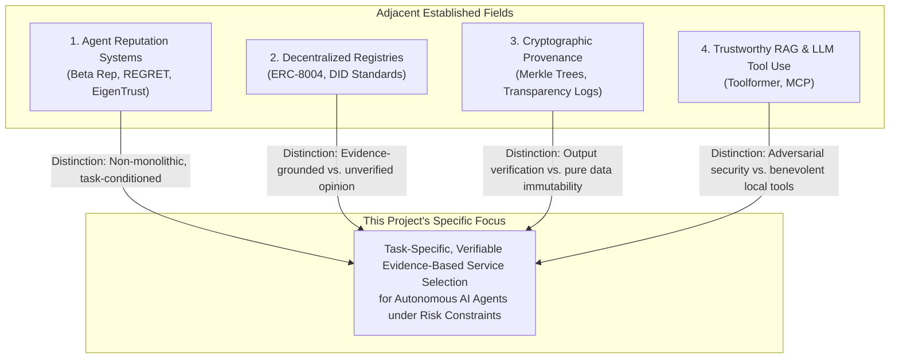

# Novelty Positioning & Distinct Contribution

To preserve academic integrity, this document articulates the precise, measured contribution of this research framework relative to existing literature. We deliberately avoid hyperbolic assertions (e.g., "first-ever," "revolutionary," or "unprecedented").

---

## 1. Precise Statement of Contribution

The core contribution of this project is neither a new cryptographic primitive nor a standalone multi-agent platform. Rather, the contribution is:

> **The formulation, architectural specification, and controlled empirical evaluation of a service-selection decision framework that conditions autonomous AI-agent delegation on task-specific, verifiable interaction evidence rather than monolithic reputation scores.**

The novelty resides in the **synthesis of the research question, the multidimensional trust model, and the controlled comparative benchmark**, specifically:
1. Formulating a mathematical and conceptual model where **task domain semantics** (via vector embeddings) weight the epistemic value of historical interaction records.
2. Demonstrating why and how **post-execution verification feedback** closes the loop to prevent behavioral drift and collusive reputation laundering.
3. Providing an open, reproducible 30-agent simulation benchmark comparing **Random Selection**, **Reputation-Only Selection**, and **Evidence-Based Selection** across five objective evaluation metrics.

---

## 2. Comparison Against Existing Research Areas

### 2.1 vs. Classical Multi-Agent Reputation (REGRET, Beta Reputation, EigenTrust)
- **What Prior Art Did:** Developed sophisticated statistical and graph-theoretic formulations to aggregate peer opinions and decay ratings over time.
- **Why It Is Insufficient for Autonomous AI Agents:** Assumed homogeneous tasks; did not account for the semantic diversity of LLM agent skills, where an agent with high ratings in text processing cannot be trusted with mathematical optimization or code execution.
- **Our Distinction:** We condition historical trust on semantic similarity between the task specification embedding and past interaction records, preventing cross-domain halo effects.

### 2.2 vs. Decentralized Agent Registries (ERC-8004, On-Chain Registries)
- **What Prior Art Did:** Provided public smart contracts for registering agent cards and submitting on-chain feedback.
- **Why It Is Insufficient:** As shown empirically by Xiong et al. (2026), open registries suffer from 59–90% Sybil collusion and 85–97% non-functional endpoints. On-chain star ratings are ungrounded opinions.
- **Our Distinction:** We treat on-chain reputation as a discounted, untrusted prior and require client agents to verify execution outputs deterministically before updating evidence.

### 2.3 vs. Cryptographic Provenance & Transparency Logs
- **What Prior Art Did:** Built append-only logs (Certificate Transparency, Merkle hash chains) guaranteeing that recorded history cannot be rewritten.
- **Why It Is Insufficient:** Cryptography guarantees that a logged record has not been altered; it does not guarantee that the agent's computation was correct or benevolent.
- **Our Distinction:** We use cryptographic commitments strictly to ensure evidence integrity, while delegating correctness evaluation to the verification layer.

### 2.4 vs. LLM Tool Augmentation & MCP (Toolformer, MCP)
- **What Prior Art Did:** Created prompt-engineering techniques, fine-tuning datasets, and JSON-RPC protocols (MCP) to allow LLMs to invoke external APIs.
- **Why It Is Insufficient:** Assumed tools are benign, static, and hosted in controlled local environments. Zero modeling of adversarial services, malicious prompt injections, or performance unreliability.
- **Our Distinction:** We design the decision-making and verification guardrail layer that sits in front of and behind tool invocation in open, untrusted environments.

---

## 3. Summary of Differentiators

| Dimension | Prior Art | Our Framework |
|---|---|---|
| **Decision Variable** | Global reputation score (1–5 stars) | Multidimensional vector (Identity, Capability, Task History, Evidence Quality, Reputation, Risk) |
| **Task Domain Match** | Ignored or manual tag filtering | Semantic cosine similarity over task embeddings (RAG) |
| **Reputation Treatment** | Final decision authority | Discounted, untrusted prior signal |
| **Verification Coupling** | Decoupled (ratings submitted post-hoc by humans or bots) | Coupled (immediate post-execution deterministic/consensus verification) |
| **Integrity Assurance** | Trust the server OR trust raw blockchain ratings | Local verification records anchored via Merkle state commitments |
