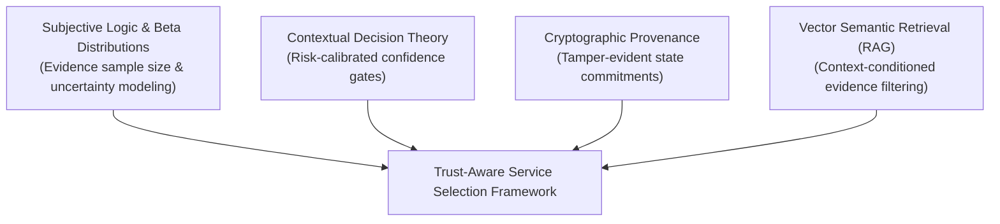

# Theoretical & Empirical Research Basis

This document formalizes the theoretical foundations and empirical pillars that underpin the **Trust-Aware Service Selection** framework.

---

## 1. Theoretical Foundations

Our framework is grounded at the intersection of three established theoretical domains:
1. **Subjective Logic & Computational Trust Theory:** Modeling trust not as an objective certainty, but as a Dirichlet/Beta probability distribution over binary outcomes modulated by uncertainty (Jøsang, 2016; Marsh, 1994).
2. **Contextual Decision Theory Under Uncertainty:** Evaluating selection candidates under bounded rationality, where the decision threshold is determined by the expected loss of failure (risk stakes) relative to the expected gain of completion (von Neumann & Morgenstern, 1944).
3. **Cryptographic Provenance & Append-Only Logs:** Utilizing tamper-evident commitment chains to ensure historical state consistency without central authorities (Crosby & Wallach, 2009; Merkle, 1987).

---

## 2. Mathematical Formalization of the Trust Decision

Let a task $T$ be defined by a domain embedding vector $\mathbf{v}_T \in \mathbb{R}^d$ and an objective risk score $R \in [0, 1]$.

Let candidate service $S_i$ be associated with an evidence corpus $\mathcal{E}_i = \{e_1, e_2, \dots, e_m\}$. Each historical evidence record $e_k$ contains:
- Task domain embedding $\mathbf{v}_{e_k} \in \mathbb{R}^d$
- Timestamp $t_k$
- Verification outcome $y_k \in \{0, 1\}$ (where $1$ denotes verified success, $0$ denotes failure)
- Verification confidence $c_k \in [0, 1]$

### 2.1 Semantic Task-Specific Weighting
For the incoming task $T$, the relevance weight $w_k$ of past evidence $e_k$ is governed by semantic cosine similarity and exponential time decay:

$$w_k = \cos(\mathbf{v}_T, \mathbf{v}_{e_k}) \cdot e^{-\lambda (t_{\text{current}} - t_k)}$$

where $\lambda > 0$ is the decay constant calibrated to the half-life of agent behavior.

### 2.2 Task-Specific Empirical Evidence Score
The evidence-grounded performance score $\mu_{\text{evidence}}(S_i, T)$ is computed as the relevance-weighted success expectation:

$$\mu_{\text{evidence}}(S_i, T) = \frac{\sum_{k=1}^m w_k \cdot y_k \cdot c_k}{\sum_{k=1}^m w_k + \epsilon}$$

where $\epsilon > 0$ is a small smoothing parameter preventing division by zero under cold-start conditions.

### 2.3 Evidence Quality & Uncertainty
The confidence $\Omega_i \in [0, 1]$ in this estimate is a monotonic concave function of the effective weighted evidence volume:

$$\Omega_i = 1 - e^{-\gamma \sum_{k=1}^m w_k}$$

where $\gamma > 0$ governs the rate at which sample volume overcomes cold-start uncertainty.

### 2.4 Incorporating Discounted Global Reputation
Let $\rho_i \in [0, 1]$ be the third-party global reputation score reported by decentralized registries. To protect against Sybil inflation, reputation is discounted by a factor $\delta \in [0, 1]$:

$$\text{Rep}_{\text{effective}}(S_i) = \delta \cdot \rho_i$$

Under high uncertainty ($\Omega_i \to 0$), the framework falls back cautiously onto discounted reputation and baseline capability checks. As empirical evidence accumulates ($\Omega_i \to 1$), empirical task-specific evidence dominates the decision.

---

## 3. Empirical Grounding: Lessons from Real-World Deployments

As established in Xiong et al. (2026), unconstrained decentralized reputation mechanisms fail due to two systemic vulnerabilities:
1. **Low Baseline Availability (Ghost Agents):** In open ecosystems, an agent cannot assume a published service endpoint is functional without live reachability evidence. Our framework treats endpoint responsiveness as an essential pre-condition of the capability dimension.
2. **Sybil Feedback Inflation:** In ERC-8004, between 59% and 90% of feedback transactions originate from coordinated clusters. In our framework, third-party reputation cannot override verified direct interaction records.

This synthesis of theoretical decision modeling and empirical real-world vulnerability analysis forms the rigorous foundation of our architecture.
