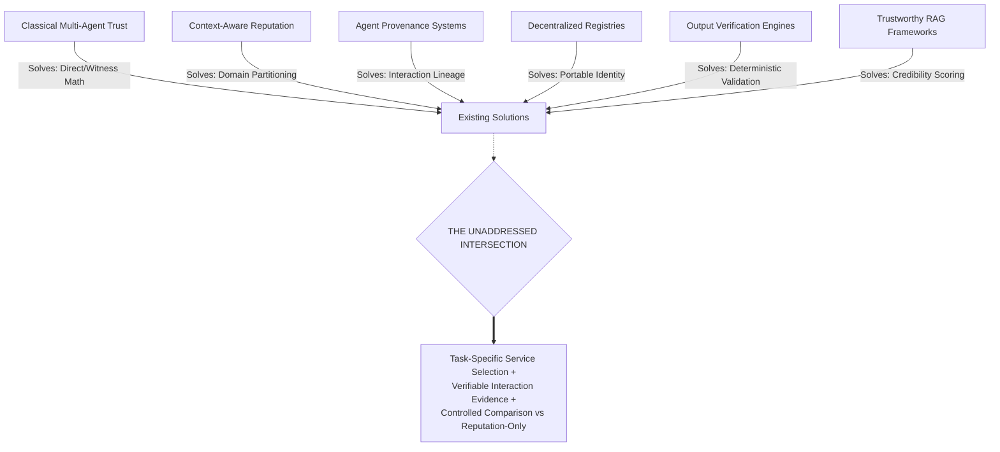

# Research Gap Analysis: Context, Prior Art Boundaries, and the Residual Gap

A critical mistake in academic computer science is to claim: *"Prior work has never studied trust in autonomous AI agents."*

Such a statement is demonstrably false. Computational trust, distributed reputation, agent provenance, verification protocols, decentralized registries, and tool-augmented language agents have been extensively researched over the past three decades.

This document conducts a rigorous boundary analysis across each adjacent subfield, defining precisely **what prior literature already solves**, **where its operational boundaries lie**, and the **exact residual intersection** addressed by our project.

---

## 1. What Prior Subfields Already Solve



### 1.1 What Classical Multi-Agent Reputation Systems Already Solve
- **Pioneering Works:** Sabater & Sierra (REGRET, 2002), Jøsang & Ismail (Beta Reputation, 2002), Kamvar et al. (EigenTrust, 2003), Huynh et al. (FIRE, 2006), Teacy et al. (TRAVOS, 2006), Yu et al. (2013).
- **What They Solve:**
  1. Mathematically formalizing trust as a statistical expectation using Bayesian Beta distributions.
  2. Separating direct interaction experience from third-party witness reports.
  3. Weighting interactions by recency using exponential decay functions to account for behavioral drift.
  4. Aggregating peer-to-peer ratings into global reputation vectors to isolate rogue participants.
- **Where Their Boundary Lies:**
  Classical models were designed for structured, low-dimensional e-commerce agents (e.g., buying CDs or compute cycles in static grid environments). They operate on scalar ratings (e.g., $+1/-1$ or 1–5 stars) associated with an agent's global identity. They lack semantic comprehension of task descriptions, cannot evaluate multimodal or unstructured outputs produced by LLMs, and assume static agent capabilities.

---

### 1.2 What Context-Conditioned Reputation Systems Already Solve
- **Pioneering Works:** Huynh et al. (FIRE, 2006), Chishti et al. (AgentReputation, ACM FSE 2026).
- **What They Solve:**
  1. Identifying the **competence-transfer failure**: an agent demonstrating high competence in code debugging does not necessarily possess competence in cryptographic auditing or database migration.
  2. Partitioning reputation into "context-conditioned reputation cards" based on discrete task categories.
  3. Implementing risk-adaptive escalation policies where higher-risk tasks require stricter verification tiers before job acceptance.
- **Where Their Boundary Lies:**
  Systems like AgentReputation focus on market-wide reputation calculation and registry architecture. They rely on historical aggregated scores stored on-chain or published by market validators. They do not evaluate whether a client agent possessing its own locally verified interaction evidence should deviate from public reputation cards, nor do they measure the empirical decision superiority of client-side evidence under coordinated Sybil attacks.

---

### 1.3 What Agent Provenance Systems Already Solve
- **Pioneering Works:** Missier et al. (W3C PROV, 2013), Souza et al. (PROV-AGENT, IEEE eScience 2025).
- **What They Solve:**
  1. Capturing fine-grained execution metadata across distributed agentic workflows (prompts, tool invocations, intermediate states, execution timestamps).
  2. Providing near real-time provenance tracking to diagnose error propagation and support post-mortem debugging.
  3. Standardizing execution traces according to formal provenance data models (W3C PROV).
- **Where Their Boundary Lies:**
  Provenance systems are fundamentally **observability and diagnostic tools**. They record *what occurred in the past*. They do not formulate predictive trust functions, compute risk-gated decision boundaries, or perform forward-looking service selection during agent planning.

---

### 1.4 What Decentralized Registries Already Solve
- **Pioneering Works:** ERC-8004 Standard Specification (2025), Zhu et al. (2026), Xiong et al. (2026).
- **What They Solve:**
  1. Providing censorship-resistant, portable agent identity via public smart contracts (ERC-721/ERC-8004).
  2. Establishing open registries where any autonomous agent can publish capability manifests and service endpoint URLs.
  3. Storing on-chain feedback events, validation attestations, and cryptographic identity bindings.
- **Where Their Boundary Lies:**
  As proven empirically by Xiong et al. (2026), public registries do not ensure endpoint uptime (85%–97% of endpoints fail live connection) and are severely vulnerable to cheap Sybil identity creation (59%–90% of feedback transactions are collusive). Registries record attestations; they do not protect the client agent from invoking non-functional or malicious endpoints.

---

### 1.5 What Output Verification & Reliability Systems Already Solve
- **Pioneering Works:** Huang et al. (ICLR 2024), Gou et al. (CRITIC, ICLR 2024).
- **What They Solve:**
  1. Empirically demonstrating that LLMs cannot reliably self-correct reasoning through internal reflection alone (Huang et al.).
  2. Demonstrating that coupling LLMs with external deterministic tools (compilers, schema validators, code interpreters, test suites) drastically improves output correctness (CRITIC).
- **Where Their Boundary Lies:**
  These frameworks focus on single-agent task correction (e.g., how an agent can fix its own Python code using a REPL). They do not address the multi-agent service marketplace problem: selecting among competing, unknown external agent services whose reliability varies dynamically.

---

### 1.6 What Tool-Use Standards & Frameworks Already Solve
- **Pioneering Works:** Schick et al. (Toolformer, NeurIPS 2023), Model Context Protocol Specification (Anthropic, 2024).
- **What They Solve:**
  1. Enabling LLMs to learn API invocation syntax and parse structured responses.
  2. Standardizing tool discovery, resource sharing, and schema negotiation between agents and tools over JSON-RPC (MCP).
- **Where Their Boundary Lies:**
  Tool-use frameworks operate under the **benevolent assumption**: they assume all external tools are well-maintained, benign, deterministic, and permanent. They incorporate zero trust scoring, adversary mitigation, or historical evidence retrieval.

---

### 1.7 What Trustworthy RAG Systems Already Solve
- **Pioneering Works:** Gao et al. (2023), Liu et al. (TrustRAG, 2026).
- **What They Solve:**
  1. Augmenting LLM reasoning with external document retrieval from vector databases.
  2. Using committee-based credibility scoring and blockchain commitments to ensure retrieved knowledge has auditable provenance.
- **Where Their Boundary Lies:**
  Trustworthy RAG evaluates the authenticity and credibility of *static textual documents* prior to generation. It does not evaluate dynamic computational services, measure endpoint execution latency, or assess multi-agent delegation risks.

---

## 2. The Unaddressed Residual Research Gap

Synthesizing the boundaries across these seven mature subfields reveals a specific, highly consequential gap:

```
[Classical Multi-Agent Trust]
       + [Context-Aware Partitioning]
              + [W3C Provenance Traces]
                     + [Tool-Interactive Verification]
                            + [Decentralized Discovery Registries]
                                   │
                                   ▼
    NO PRIOR WORK HAS INTEGRATED THESE CAPABILITIES INTO:
    A closed-loop, evidence-grounded service selection framework for autonomous AI agents,
    backed by a controlled empirical comparison demonstrating whether local, verified interaction evidence
    improves decision accuracy and failure avoidance over public reputation-only baselines.
```

### The Exact Research Gap Defined:

1. **Absence of a Closed-Loop Trust Architecture for Agent Service Selection:**
   Existing literature either computes reputation without verifying execution outputs (ERC-8004, EigenTrust), verifies outputs without updating long-term selection models (CRITIC), or records execution traces without using them for predictive decision-making (PROV-AGENT). No unified framework closes the loop: **Discovery $\to$ Semantic Evidence Retrieval $\to$ Risk-Gated Selection $\to$ Multi-Tier Verification $\to$ Evidence Store Persistence $\to$ Registry Provenance Anchoring**.

2. **Lack of Controlled Empirical Comparisons (Evidence vs. Reputation-Only):**
   While literature intuitively suggests that "more evidence is better," no prior study has set up a controlled, adversarial multi-agent benchmark measuring the exact performance differential between:
   - Baseline 1: Random Selection
   - Baseline 2: Global Scalar Reputation (EigenTrust/ERC-8004 stars)
   - Baseline 3: Context-Conditioned Reputation (AgentReputation cards)
   - Proposed: Task-Specific Verifiable Evidence with Risk-Gating
   under varying ratios of deceptive providers, Sybil rating rings, and dormant malicious agents.

3. **Absence of Semantic Evidence Retrieval for Tool Invocations:**
   When an agent must execute a complex task, relying solely on discrete category tags (e.g., `code-analysis`) fails to capture nuanced capability constraints (e.g., `Python AST parsing with Python 3.12 syntax`). No framework uses dense vector embeddings to retrieve granular, semantically matching historical execution records to inform the trust calculation.

---

## 3. Summary of Research Positioning

| Research Dimension | State of Prior Literature | Our Focused Contribution |
|:---|:---|:---|
| **Trust Source** | Global star ratings or public category cards. | Client-side, locally verified interaction evidence combined with discounted public priors. |
| **Output Verification** | Self-prompt reflection (proven flawed by Huang et al.) or unverified trust. | Deterministic 4-tier verification (Schema $\to$ Assertions $\to$ Multi-Agent Consensus $\to$ Trace Audit). |
| **Tool Protocol** | Benevolent, trusted tool calls (MCP, Toolformer). | Adversarial-aware, evidence-gated tool selection wrapping standardized MCP interfaces. |
| **Blockchain Role** | Treated as an all-in-one trust engine (refuted by Xiong et al. and Zhu et al.). | Scoped strictly to immutable state roots, DID resolution, and non-repudiable audit trails. |
| **Empirical Validation** | Observational measurements (Xiong et al.) or single-agent benchmarks (CRITIC). | Controlled 30-agent benchmark evaluating Task Success Rate (TSR) and Malicious Selection Rate (MASR). |
