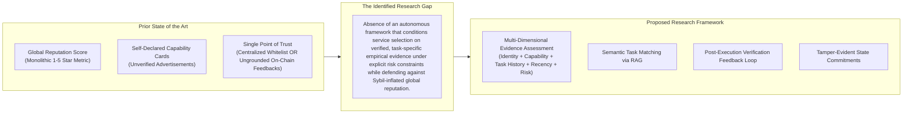

# The Research Gap: From Monolithic Reputation to Verifiable Task-Grounded Trust

This document defines the exact boundary separating prior art from the contribution of this research framework.

---

## 1. The Core Research Gap

In multi-agent systems and decentralized AI marketplaces, the existing state of the art relies almost exclusively on one of two paradigms:
1. **Centralized Curation:** A single platform operator maintains a whitelist of verified tools (e.g., OpenAI Plugin Store, Anthropic MCP directories). This approach breaks decentralization, creates platform lock-in, and fails to scale to millions of dynamic micro-agents.
2. **Global Aggregate Reputation:** Systems like ERC-8004 introduce open on-chain registries where users and peer agents submit numerical ratings.

### The Breakdown of Global Reputation
As demonstrated both theoretically and empirically:
- **Sybil Vulnerability:** Without expensive proof-of-work or physical identity verification, an attacker can create thousands of disposable agent wallets to submit positive ratings, inflating a malicious service's score to near-perfect levels.
- **Domain Collapse (The "Halo Effect"):** A service provider that reliably completes simple text summarization accumulates high aggregate reputation. When selected for a sensitive data extraction or mathematical verification task, it fails catastrophically. The global reputation metric contains zero task-domain resolution.
- **Lack of Verification Coupling:** Existing reputation protocols record *opinions* (e.g., a 5-star rating transaction), not *verified execution outcomes*. An opinion can be fabricated; a verified execution trace requires passing a deterministic or consensus check.

---

## 2. Detailed Gap Analysis Matrix

| Feature / Capability | Centralized Directories | On-Chain Registries (ERC-8004) | Classical Multi-Agent Trust (REGRET) | Our Proposed Framework |
|---|---|---|---|---|
| **Decentralized Discovery** | No (Single gatekeeper) | Yes | Yes (P2P networks) | Yes |
| **Resilience to Sybil Inflation** | High (Human vetting) | Very Low (59-90% Sybil observed) | Moderate (Witness graphs) | High (Discounted reputation + Direct evidence) |
| **Task-Specific Resolution** | Low (Broad category tags) | None (Single global score) | None / Rudimentary | High (Semantic vector matching via RAG) |
| **Verification Grounding** | Variable (App store review) | None (Unverified user ratings) | None (Subjective feedback) | High (Deterministic & schema verification) |
| **Dynamic Feedback Loop** | Slow (Manual deprecation) | Slow / Non-existent | Yes (Bayesian decay) | Yes (Automated real-time evidence update) |
| **Cryptographic Provenance** | None | Yes (Ethereum transactions) | None | Yes (Merkle roots of verified traces) |

---

## 3. The Specific Gap Addressed by This Project

This project specifically investigates:

> **How can an autonomous client agent systematically evaluate, retrieve, and weigh empirical, task-specific interaction evidence against untrusted third-party reputation to maximize task success and minimize malicious service selection under uncertainty?**

By framing the selection decision around verified task evidence and explicitly modeling risk thresholds, this project bridges the chasm between ungrounded decentralized agent registries and mission-critical autonomous execution.
