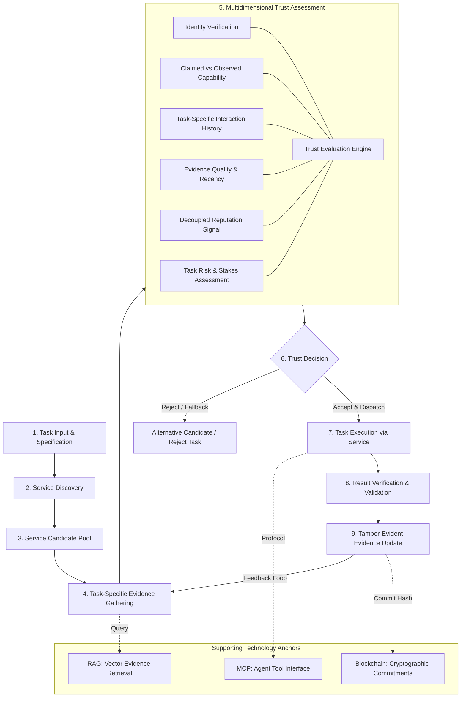
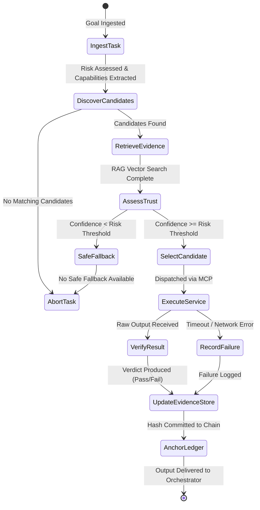

# System Architecture Specification

This document provides the definitive architectural specification for the **Trust-Aware Service Selection Framework**, establishing component boundaries, interfaces, state transitions, and verification pipelines.

---

## 1. High-Level Architectural Pipeline

The system is structured as a closed-loop verification engine where every service invocation produces empirical evidence that updates future selection decisions:

---

## 2. The 10 System Components

The framework is partitioned into 10 modular components with strict encapsulation:

| # | Component Name | Primary Responsibility | Critical Interfaces |
|---|---|---|---|
| **1** | **Autonomous Client Agent** | Coordinates goal decomposition, initiates selection, and executes overall agentic workflow. | Input: Goal Task; Output: Verified Output |
| **2** | **Service Discovery Layer** | Queries registries (ERC-8004 or local catalogs) to identify candidates matching required capabilities. | `discover_candidates(capability_query)` |
| **3** | **Service Candidate Store** | In-memory cache holding candidate metadata, advertised schemas, and reachability endpoints. | `filter_reachable()`, `get_metadata()` |
| **4** | **Evidence Store & Vector DB** | Stores historical execution traces locally and indexes them by task-domain embedding (RAG). | `query_evidence(service_id, task_vector)` |
| **5** | **Trust Evaluation Engine** | Evaluates multidimensional signals: Identity, Capability, Task History, Evidence Quality, Reputation. | `evaluate_trust(candidate, task_spec)` |
| **6** | **Risk Assessment Layer** | Computes task stakes, reversibility, and assigns the required confidence threshold $\theta(R)$. | `calculate_task_risk(task_spec)` |
| **7** | **Selection Engine** | Ranks candidates according to the active strategy (Random, Reputation, or Evidence-Based) and issues decision. | `select_service(candidates, trust_scores)` |
| **8** | **Task Execution Layer** | Dispatches task parameters to the selected service provider via standardized MCP tool calls. | `invoke_mcp_tool(service_id, params)` |
| **9** | **Result Verification Layer** | Validates execution output against deterministic assertions, schemas, or consensus oracles. | `verify_result(task_spec, raw_output)` |
| **10** | **Evidence Update Layer** | Ingests verification verdicts, computes state commitments, updates local RAG index, and anchors hashes. | `record_interaction(evidence_record)` |

---

## 3. End-to-End Execution State Transitions

---

## 4. Failure Modes & Graceful Degradation

1. **Complete Candidate Absence:** If no candidate matches the required capability schema, the client agent aborts cleanly or triggers internal fallback without making external calls.
2. **Confidence Deficit on High-Stakes Task:** If all candidates have low task-specific evidence confidence ($\Omega_i < \theta(R)$) on a high-stakes task, the engine refuses execution rather than gambling on unverified reputation.
3. **Service Timeout / Crash:** If a selected service fails to respond within the latency budget, the Execution Layer generates an automatic `TIMEOUT_FAILURE` evidence record, immediately penalizing the service's recency score.
4. **Verification Failure:** If the returned payload fails schema validation or unit tests, the output is discarded, preventing poisoned data from entering the client agent's reasoning loop.
