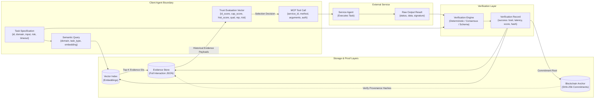

# End-to-End Data Flow Specification

This document details the transformation, flow, and schema lifecycles of data packets as they travel across system components during a service selection and execution cycle.

---

## 1. End-to-End Data Flow Diagram



---

## 2. Step-by-Step Data Packet Transitions

### Step 1: Ingestion & Vectorization
- **Inbound:** Raw user goal string (e.g., `"Calculate the optimal convex hull for coordinate set X and return JSON."`)
- **Transformation:** The client agent parses the goal into a structured `TaskSpecification`:
  ```json
  {
    "task_id": "task_1042",
    "domain": "computational_geometry",
    "input_payload": { "points": [[0,0], [1,1], [2,0], [1,0.5]] },
    "risk_level": "HIGH",
    "timeout_ms": 3000
  }
  ```
- **Embedding:** Generates 384-dimensional dense semantic embedding $\mathbf{v}_T$ using local transformer model.

### Step 2: Evidence Retrieval (RAG Query)
- **Query Vector:** $\mathbf{v}_T$.
- **Filter:** `candidate_ids = [S_1, S_2, ..., S_n]`.
- **Returned Data:** Top-$K$ relevant `EvidenceRecord` objects per candidate matching the domain with cosine similarity $\ge 0.65$.

### Step 3: Trust Evaluation Synthesis
- **Input Data:** Retrieved evidence records + registry metadata (identity, claimed capabilities, raw reputation $\rho_i$).
- **Output Data:** `TrustAssessment` vector per candidate:
  ```json
  {
    "service_id": "service_07",
    "expected_success_rate": 0.942,
    "confidence_omega": 0.88,
    "discounted_reputation": 0.45,
    "recommendation": "ACCEPT"
  }
  ```

### Step 4: Dispatch Payload (MCP)
- **Formatting:** Formats parameters into standardized MCP JSON-RPC `tools/call` schema.
- **Dispatch:** Transmitted over TLS/HTTPS to candidate service endpoint.

### Step 5: Verification & Ledger Commitment
- **Verification Ingestion:** Pairs `TaskSpecification.input_payload` and `RawResult.data`.
- **Verdict Generation:** Unit test suite runs inside subprocess sandbox; returns `VerificationRecord(is_success=True, score=1.0)`.
- **State Commitment:** Appends record to local DB, updates vector index, and computes SHA-256 Merkle root to anchor on-chain.
