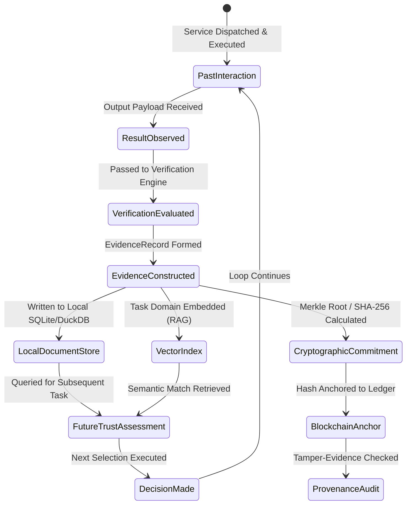

# Evidence Model & Lifecycle Specification

This document formalizes the structure, schemas, storage boundaries, and lifecycle transitions of **Evidence Records** within the Trust-Aware Service Selection framework.

---

## 1. The Evidence Lifecycle

The evidence model implements a closed feedback loop: past observations dictate present decisions, and present execution outcomes generate evidence for future selections.



---

## 2. Core Entities & Formal Definitions

1. **Interaction:** The complete end-to-end exchange consisting of the client request, transport handshake, service execution, latency measurement, and returned response.
2. **Task Specification:** The formal definition of the work assigned, including domain identifier, input parameters, expected schema, deadline, and assigned risk tier.
3. **Claimed Capability:** The self-advertised feature profile published by the service provider (e.g., OpenAPI spec, supported methods, claimed accuracy).
4. **Observed Behaviour:** The empirical execution characteristics exhibited by the service during invocation (actual wall-clock latency, HTTP status code, exceptions, payload formatting).
5. **Task Result:** The unverified output payload returned by the service provider.
6. **Verification Outcome:** The binary or scalar score ($y \in \{0, 1\}$ or $q \in [0, 1]$) assigned by the Verification Layer confirming functional correctness and schema compliance.
7. **Evidence Quality:** A composite metric reflecting the sample size, recency (time-decay), and verification rigor (deterministic vs. heuristic) of an evidence record.
8. **Provenance:** The verifiable cryptographic chain of custody linking the task specification, client signature, service signature, and verifier verdict.
9. **Evidence Commitment:** A cryptographic hash (SHA-256 Merkle root) of a batch of evidence records anchored to an immutable ledger to guarantee tamper-evidence.
10. **Trust Update:** The state transition wherein new verified evidence recalculates the candidate's historical competence score.

---

## 3. Storage Boundaries: What Stays Off-Chain vs. What Goes On-Chain

A foundational architectural principle of this framework is the strict separation between heavy, private off-chain data and lightweight, cryptographic on-chain commitments:

```text
┌─────────────────────────────────────────────────────────────────────────────┐
│  OFF-CHAIN EVIDENCE STORE (Local SQLite / DuckDB / Private Cache)          │
├─────────────────────────────────────────────────────────────────────────────┤
│  ✓ Full JSON task specifications and input arguments                       │
│  ✓ Complete raw response payloads returned by services                      │
│  ✓ Detailed execution logs, stack traces, and latency telemetry            │
│  ✓ Vector embeddings of task domain descriptions (for RAG retrieval)        │
│  ✓ Detailed verification test assertions and diffs                          │
│                                                                             │
│  WHY OFF-CHAIN: High throughput, zero gas fees, data privacy, compliance,   │
│                 unlimited storage capacity.                                 │
└──────────────────────────────────────┬──────────────────────────────────────┘
                                       │ Batch Merkle Tree / SHA-256 Hash
                                       ▼
┌─────────────────────────────────────────────────────────────────────────────┐
│  ON-CHAIN LEDGER / TRANSPARENCY LOG (Ethereum / Base / L2 Smart Contract)   │
├─────────────────────────────────────────────────────────────────────────────┤
│  ✓ Merkle Root of Evidence Batches: H(e_1 || e_2 || ... || e_k)             │
│  ✓ Timestamp and Block Height of Commitment                                 │
│  ✓ Cryptographic Signatures of Client Agent & Verifier                      │
│  ✓ Dispute Resolution Attestations (if challenge occurs)                    │
│                                                                             │
│  WHY ON-CHAIN: Guarantees post-hoc tamper-evidence; prevents an agent from   │
│                selectively deleting negative performance history;           │
│                minimal gas overhead (32 bytes per batch).                   │
└─────────────────────────────────────────────────────────────────────────────┘
```

---

## 4. Formal Evidence Schema (`EvidenceRecord`)

```json
{
  "$schema": "https://json-schema.org/draft/2020-12/schema",
  "title": "EvidenceRecord",
  "type": "object",
  "properties": {
    "evidence_id": { "type": "string", "format": "uuid" },
    "task_id": { "type": "string", "format": "uuid" },
    "service_id": { "type": "string" },
    "client_id": { "type": "string" },
    "task_domain": { "type": "string" },
    "task_embedding": {
      "type": "array",
      "items": { "type": "number" },
      "description": "384-dim semantic embedding of task spec"
    },
    "risk_level": { "type": "string", "enum": ["LOW", "MEDIUM", "HIGH", "CRITICAL"] },
    "execution_metrics": {
      "type": "object",
      "properties": {
        "latency_ms": { "type": "number" },
        "status_code": { "type": "integer" },
        "timeout_occurred": { "type": "boolean" }
      },
      "required": ["latency_ms", "status_code", "timeout_occurred"]
    },
    "verification": {
      "type": "object",
      "properties": {
        "is_success": { "type": "boolean" },
        "rigor_score": { "type": "number", "minimum": 0.0, "maximum": 1.0 },
        "verification_type": { "type": "string", "enum": ["DETERMINISTIC", "SCHEMA", "CONSENSUS"] },
        "verifier_id": { "type": "string" }
      },
      "required": ["is_success", "rigor_score", "verification_type"]
    },
    "timestamp": { "type": "integer", "description": "Unix epoch seconds" },
    "provenance_hash": { "type": "string", "description": "SHA-256 hash of (task + response + verification)" },
    "on_chain_commitment_tx": { "type": ["string", "null"] }
  },
  "required": [
    "evidence_id", "task_id", "service_id", "task_domain",
    "risk_level", "execution_metrics", "verification", "timestamp", "provenance_hash"
  ]
}
```
