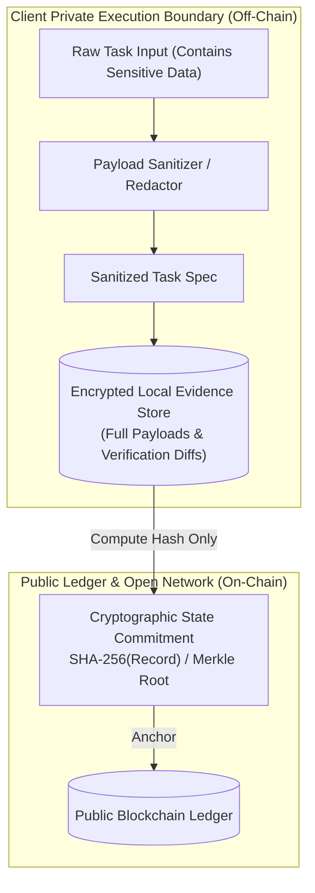

# Privacy Model & Data Protection

This document specifies the data protection boundaries, privacy-preserving mechanisms, and payload sanitization protocols within the **Trust-Aware Service Selection Framework**.

---

## 1. Privacy Challenges in Multi-Agent Delegation

When an autonomous client agent delegates tasks to external service providers, it faces significant privacy risks:
- **Payload Leakage:** Task inputs may contain proprietary algorithms, financial balances, Personally Identifiable Information (PII), or confidential corporate records.
- **Public Ledger Exposure:** If historical interaction records or verification traces are stored on a public blockchain, all task parameters and outputs become permanently visible to competitors and adversaries.
- **Inference & Profiling:** An external observer monitoring transaction frequency and endpoint calls could reconstruct the client agent's high-level business workflow.

---

## 2. Privacy Architecture: Off-Chain Privacy with On-Chain Proofs

### 2.1 Zero Sensitive Data On-Chain
- Under no circumstances are raw task inputs, responses, or full text logs written to a public blockchain or shared registry.
- Only **32-byte cryptographic hashes** (or Merkle roots) are anchored on-chain. An external observer viewing the blockchain cannot invert the hash to recover task contents ($H = \text{SHA-256}(\text{payload})$).

### 2.2 Pre-Delegation Payload Sanitization
- Before dispatching an execution request to an external service via MCP, the Task Execution Layer routes the payload through a sanitization pipeline:
  - *PII Scrubbing:* Automatically detects and redacts emails, telephone numbers, IP addresses, and named entities.
  - *Synthetic Tokenization:* Replaces sensitive account identifiers with temporary pseudo-random session tokens.
  - *Parameter Minimization:* Strips unneeded context; sends strictly the minimum data required for computation.

### 2.3 Local Evidence Encryption at Rest
- The local SQLite / DuckDB evidence store is encrypted using SQLCipher / AES-256 with keys stored in the host system's secure keystore (e.g., Windows Credential Manager, Linux Secret Service).
- Vector embeddings in the local vector database are generated over sanitized task abstractions (e.g., domain category and abstract problem schema) rather than raw sensitive parameters.

---

## 3. Privacy Compliance & Threat Matrix

| Threat Vector | Mitigation Strategy | Residual Risk |
|---|---|---|
| **Eavesdropping on Transport** | Strict TLS 1.3 encryption with certificate validation on all MCP/HTTP calls. | Metadata visibility (IP, packet size) to network ISPs. |
| **Service Provider Data Retention** | Mandatory ephemeral data processing agreements; synthetic parameter masking. | Malicious provider logging sanitized parameters. |
| **Public On-Chain Inspection** | Zero raw data on-chain; only Merkle roots of interaction hashes committed. | None (Pre-image resistance of SHA-256). |
