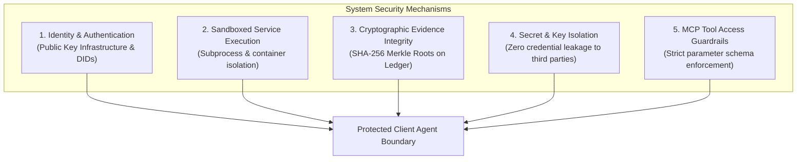

# Security Model & Cryptographic Safeguards

This document formalizes the security architecture, access control policies, cryptographic integrity controls, and the fundamental distinction between **Trustworthiness** and **Security**.

---

## 1. Conceptual Distinction: Trustworthiness vs. Security

A common failure in multi-agent system design is treating "security" and "trustworthiness" as synonymous. In this framework, we enforce a strict conceptual separation:

```text
┌─────────────────────────────────────────────────────────────────────────────┐
│  SECURITY vs. TRUSTWORTHINESS                                               │
├───────────────────┬─────────────────────────────────────────────────────────┤
│ Dimension         │ Security                                                │
├───────────────────┼─────────────────────────────────────────────────────────┤
│ Definition        │ Binary or categorical enforcement of access boundaries, │
│                   │ cryptographic authentication, and system invariants.    │
├───────────────────┼─────────────────────────────────────────────────────────┤
│ Key Questions     │ • Is the caller cryptographically authenticated?        │
│                   │ • Is the transport channel encrypted via TLS?           │
│                   │ • Has the evidence payload been tampered with?          │
│                   │ • Is the execution sandboxed from the host OS?          │
├───────────────────┼─────────────────────────────────────────────────────────┤
│ Guarantee Type    │ Hard technical guarantee (cryptographic or architectural)│
└───────────────────┴─────────────────────────────────────────────────────────┘
                                       vs.
┌─────────────────────────────────────────────────────────────────────────────┐
│ Dimension         │ Trustworthiness                                         │
├───────────────────┼─────────────────────────────────────────────────────────┤
│ Definition        │ Probabilistic assessment of competence, intent, and     │
│                   │ behavioral reliability under uncertainty.               │
├───────────────────┼─────────────────────────────────────────────────────────┤
│ Key Questions     │ • Will this agent solve this specific task correctly?   │
│                   │ • Is the agent prone to subtle hallucinations or drift? │
│                   │ • Does the agent's historical competence match risk?    │
│                   │ • Is this service likely to exit-scam on high stakes?   │
├───────────────────┼─────────────────────────────────────────────────────────┤
│ Guarantee Type    │ Soft probabilistic expectation (Bayesian confidence)   │
└───────────────────┴─────────────────────────────────────────────────────────┘
```

> **Key Takeaway:** An external service can be 100% **secure** (valid SSL, authenticated API keys, valid Ed25519 signature) yet be completely **untrustworthy** (returns hallucinated, incorrect, or deceptive data). Conversely, a highly competent model cannot be safely utilized without technical security controls.

---

## 2. Core Security Pillars



### 2.1 Identity Validation & Public Key Infrastructure
- Candidate services are identified by public key cryptography (Ed25519 or secp256k1).
- Every service payload must be accompanied by a cryptographic signature over the response hash:
  $$\sigma = \text{Sign}_{SK_{\text{service}}}\Big(\text{SHA-256}(\text{task\_id} \parallel \text{result\_payload} \parallel \text{timestamp})\Big)$$
- Spoofed identities and unauthenticated endpoints are dropped before reaching the Trust Evaluation Engine.

### 2.2 Execution Sandboxing & Tool Isolation
- External services are treated as **adversarial third-party code**.
- Outputs are never directly fed into `eval()`, system shells, or unescaped prompt templates.
- Verification scripts (e.g., executing Python code to test a service output) execute within restricted subprocesses with memory limits (512 MB), CPU time limits (2000 ms), and disabled network access.

### 2.3 Evidence & Provenance Integrity
- Historical interaction logs stored locally in SQLite/DuckDB are protected with filesystem permissions.
- Batches of evidence records are hashed into a Merkle tree:
  $$\text{Root} = \text{MerkleTree}\Big(H(e_1), H(e_2), \dots, H(e_m)\Big)$$
- Anchoring the Merkle root to an append-only ledger prevents an attacker with temporary database access from silently altering past failure records.

### 2.4 Secret & Credential Handling
- External service providers are **NEVER** provided with client credentials, root API keys, or private keys.
- If a task requires external API access (e.g., querying GitHub), the client agent delegates the query with restricted, scoped, short-lived bearer tokens or executes the query locally and delegates only computational transformation.

### 2.5 Blockchain Key Management
- Client agents maintain separate operational keys:
  - *Signing Key (Hot):* Signs MCP requests and local evidence batches.
  - *Ledger Key (Warm):* Submits state commitments to blockchain RPC nodes.
  - *Identity Key (Cold):* Master identity key stored offline; used only for agent card certificate issuance.
