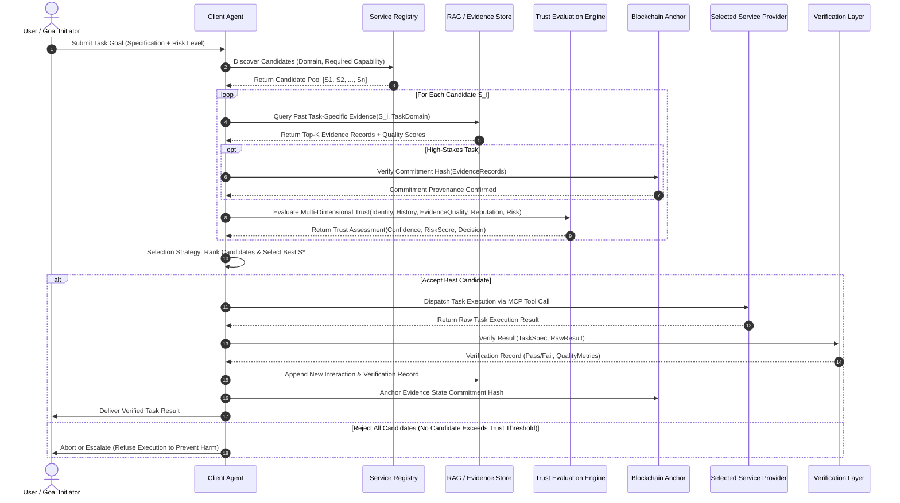
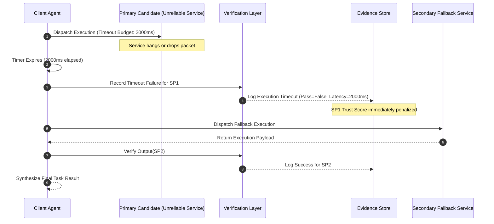

# Sequence Diagrams & Protocol Lifecycles

This document provides detailed sequence diagrams capturing synchronous and asynchronous message exchanges during candidate discovery, trust evaluation, execution, verification, and failure recovery.

---

## 1. Happy Path: Successful Selection, Execution, & Evidence Anchoring



---

## 2. Unhappy Path: Service Timeout & Fallback Execution



---

## 3. Adversarial Path: Malicious Output Interception

```mermaid
sequenceDiagram
    autonumber
    participant CA as Client Agent
    participant MalService as Malicious Service (High Sybil Reputation)
    participant VL as Verification Layer
    participant ES as Evidence Store

    CA->>MalService: Dispatch High-Risk Mathematical Task
    MalService-->>CA: Return Malicious Payload (Poisoned values / Prompt injection)
    CA->>VL: Route Payload to Verification Sandbox
    Note over VL: Deterministic unit tests fail; prompt injection detected
    VL-->>CA: Verification Verdict: FAILURE (Confidence: 1.0, Flags: ["INJECTION_DETECTED"])
    CA->>ES: Record Tamper-Evident Negative Evidence
    CA->>CA: Blacklist MalService from Session & Abort Task
```
