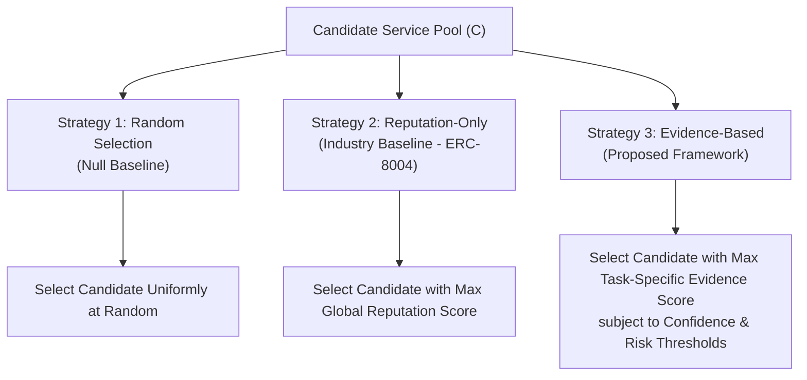

# Service Selection Strategies Specification

This document defines the algorithmic mechanics, assumptions, and failure profiles of the three comparative service-selection strategies evaluated in this research framework.

---

## 1. Comparative Strategy Overview

To determine whether task-specific verifiable evidence improves autonomous service selection, we define three distinct selection strategies:

---

## 2. Strategy 1: Random Selection (Null Baseline)

### 2.1 Algorithmic Definition
Given a candidate pool $\mathcal{C} = \{S_1, S_2, \dots, S_n\}$ of services that advertise compatibility with the required task schema, the selection probability for any candidate $S_i$ is uniform:

$$P(S_i \text{ selected}) = \frac{1}{|\mathcal{C}|}$$

### 2.2 Role in the Experiment
- Acts as the mathematical **null baseline**.
- Measures the default probability of failure in an uncurated market. In a population of 30 agents containing 5 malicious and 5 unreliable providers, random selection establishes the unmitigated failure rate.
- Incurs near-zero decision latency ($SDL \approx 0$) and zero evidence storage overhead.

### 2.3 Expected Failure Modes
- High rate of selecting non-functional, degraded, or adversarial agents.
- Catastrophic failure on high-stakes tasks.

---

## 3. Strategy 2: Reputation-Only Selection (Industry Baseline)

### 3.1 Algorithmic Definition
Replicating standard decentralized agent registries (such as ERC-8004, decentralized rating smart contracts, or centralized app store star ratings), Strategy 2 selects the reachable candidate exhibiting the highest aggregate global reputation score $\rho_i \in [0, 1]$:

$$S^* = \arg\max_{S_i \in \mathcal{C}} \rho_i$$

where $\rho_i$ is computed as the arithmetic mean of all historical ratings submitted by external users and peer agents across all tasks:

$$\rho_i = \frac{1}{|R_i|} \sum_{r \in R_i} r$$

### 3.2 Role in the Experiment
- Represents current **industry best practice** in decentralized agent marketplaces.
- Evaluates whether network-wide feedback is sufficient to govern autonomous delegation.

### 3.3 Known Vulnerabilities & Failure Profiles
- **Sybil Susceptibility:** Because $\rho_i$ treats all reviewer accounts equally, collusive Sybil syndicates can artificially inflate a malicious agent's rating to $0.98+$, causing Strategy 2 to actively prefer malicious services over honest services that lack collusive funding.
- **Domain Blindness:** High ratings earned on simple tasks inflate selection probability for complex or sensitive tasks where the agent has zero competence.

---

## 4. Strategy 3: Evidence-Based Selection (Proposed Framework)

### 4.1 Algorithmic Definition
Strategy 3 selects candidates based on **task-specific empirical performance**, filtering candidates through confidence and risk gates before ranking:

1. **Candidate Filtering:** A candidate $S_i$ is eligible if and only if:
   $$\text{Reachable}(S_i) \wedge \text{IdentityValid}(S_i) \wedge \Big(\Omega_i \ge \Omega_{\text{min}}(R)\Big) \wedge \Big(E(S_i, T) \ge \theta(R)\Big)$$
2. **Optimal Selection:** From the eligible set $\mathcal{C}_{\text{eligible}}$, the engine selects the candidate maximizing expected task success:
   $$S^* = \arg\max_{S_i \in \mathcal{C}_{\text{eligible}}} E(S_i, T)$$
3. **Safe Rejection:** If $\mathcal{C}_{\text{eligible}} = \emptyset$, the engine rejects task delegation:
   $$S^* = \text{REJECT}$$

### 4.2 Role in the Experiment
- Tests the core research hypothesis: that conditioning decisions on task-specific, verified interaction evidence significantly reduces malicious agent selection while maintaining high task success.

### 4.3 Trade-offs & Potential Failure Modes
- **Cold-Start Conservatism:** In novel task domains with sparse historical evidence, Strategy 3 may reject delegation (increasing False Rejection Rate $FRR$) even if an unfamiliar candidate is capable.
- **Overhead:** Incurs vector search latency and verification computational costs.

---

## 5. Fair Comparative Evaluation Matrix

| Dimension | Random Selection | Reputation-Only Selection | Evidence-Based Selection |
|---|---|---|---|
| **Primary Decision Variable** | Stochastic draw | Global aggregate rating ($\rho_i$) | Task-specific verified performance ($E(S_i, T)$) |
| **Task Domain Context** | Ignored | Ignored | Explicitly matched via vector embeddings |
| **Risk Gating** | None | None | Explicit threshold $\theta(R)$ |
| **Safe Rejection Capacity** | No (Always delegates) | No (Always selects $\max \rho_i$) | Yes (Can abort to prevent harm) |
| **Decision Latency ($SDL$)** | Minimal ($< 1$ ms) | Low ($< 5$ ms) | Moderate ($15 - 50$ ms due to RAG) |
| **Resilience to Sybil Inflation** | Unaffected (Stochastic) | Severely Compromised | Resilient (Reputation discounted) |
