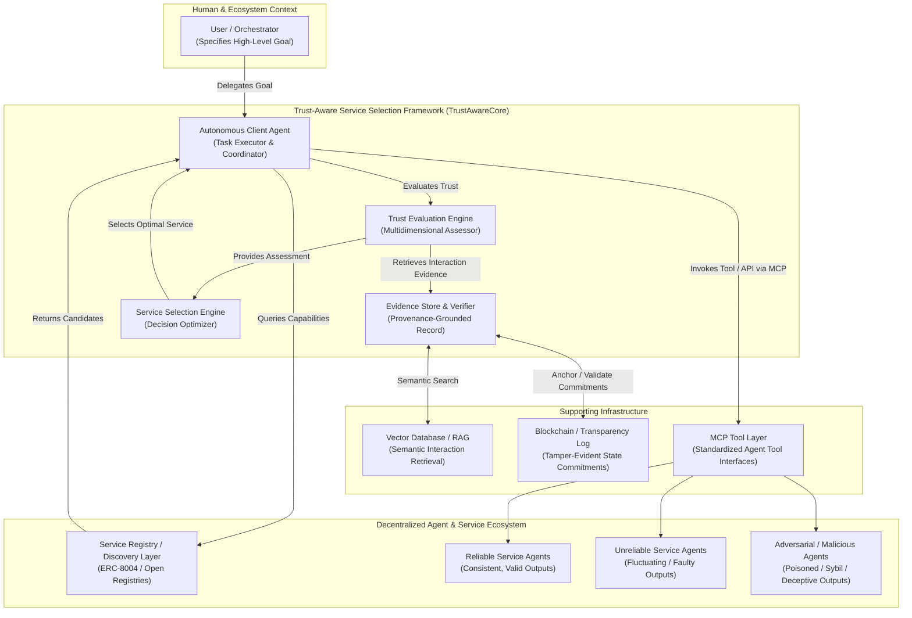

# System Context: Trust-Aware Service Selection Framework

This document defines the boundary of the **Trust-Aware Service Selection Framework** (TrustAwareCore) using C4 System Context modeling, outlining external users, dependent services, and infrastructure anchors.

---

## 1. System Context Diagram

---

## 2. External Entities & Actors

### 2.1 User / Goal Orchestrator
- **Role:** Initiates high-level goals (e.g., "Analyze quarterly financial report and verify audit assertions").
- **Interaction:** Submits task specifications and risk tolerance to the Autonomous Client Agent.
- **Trust Assumption:** The orchestrator is assumed to be authorized and benevolent.

### 2.2 Service Registry / Discovery Layer
- **Role:** Provides directory lookups for service agents advertising capabilities matching required schemas (e.g., ERC-8004 registries, local catalogs).
- **Trust Boundary:** **UNTRUSTED.** The registry contains unverified self-advertised agent cards, dead endpoints (85-97%), and Sybil clusters.

### 2.3 Candidate Service Agents
- **Role:** Third-party computational providers executing requested tasks.
- **Population Heterogeneity:**
  - *Reliable Services:* Execute tasks correctly with high probability and low latency.
  - *Unreliable Services:* Suffer from intermittent timeouts, non-deterministic exceptions, or degraded models.
  - *Malicious Services:* Adversarial actors executing prompt injection, returning poisoned outputs, or participating in Sybil feedback collusion.
- **Trust Boundary:** **UNTRUSTED.** Must be isolated and verified post-execution.

---

## 3. Core Supporting Infrastructure

1. **RAG / Vector Database:** Maintains high-dimensional vector embeddings of task specifications and historical execution traces, allowing fast semantic retrieval of task-specific evidence.
2. **Blockchain / Transparency Log:** Acts as an immutable append-only commitment store for Merkle roots of interaction logs. Guarantees tamper-evidence without storing private or heavy payloads.
3. **Model Context Protocol (MCP):** Provides the standardized transport layer for tool invocation, parameters, and structured return payloads.
