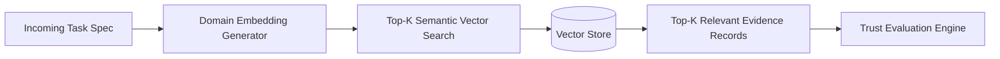
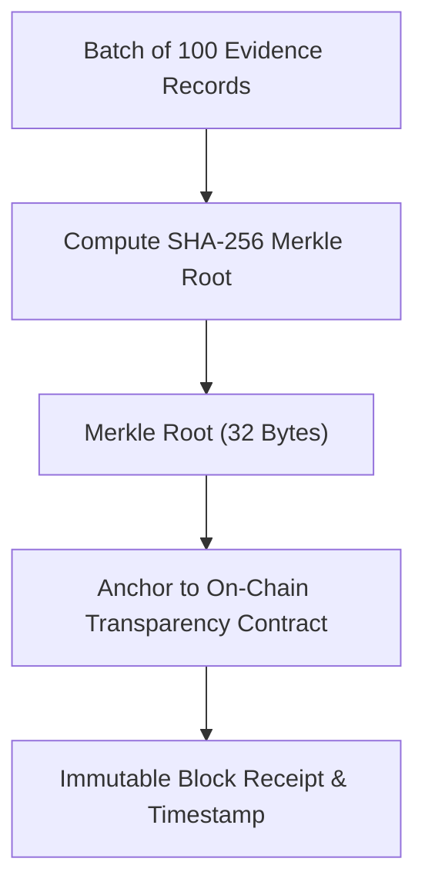

# Technology Roles & Architectural Justifications

This document provides explicit architectural justifications for each supporting technology integrated into the framework: **Retrieval-Augmented Generation (RAG)**, the **Model Context Protocol (MCP)**, **Blockchain / Decentralized Ledgers**, and **x402 Micropayments**.

We explicitly define **what each technology does**, **what problem it solves**, and **what it does NOT solve**.

---

## 1. Architectural Technology Matrix

```text
┌─────────────────────────────────────────────────────────────────────────────┐
│  TECHNOLOGY ROLES & BOUNDARIES                                              │
├────────────┬─────────────────────────────┬──────────────────────────────────┤
│ Technology │ What Problem It Solves      │ What It Does NOT Solve           │
├────────────┼─────────────────────────────┼──────────────────────────────────┤
│ RAG        │ Semantic retrieval of task- │ Does NOT verify whether past     │
│            │ specific historical traces  │ evidence was truthful or faked.  │
├────────────┼─────────────────────────────┼──────────────────────────────────┤
│ MCP        │ Standardized tool invocation│ Does NOT provide trust, security,│
│            │ and parameter transport     │ or behavioral guarantees.        │
├────────────┼─────────────────────────────┼──────────────────────────────────┤
│ Blockchain │ Tamper-evident commitments; │ Does NOT make false claims true; │
│            │ post-hoc deletion defense   │ does NOT verify LLM output logic.│
├────────────┼─────────────────────────────┼──────────────────────────────────┤
│ x402       │ [Future] Programmatic       │ Does NOT establish whether the   │
│            │ settlement upon verified OK │ service is safe prior to call.   │
└────────────┴─────────────────────────────┴──────────────────────────────────┘
```

---

## 2. Retrieval-Augmented Generation (RAG)



### 2.1 Why RAG is Needed
Autonomous agents accumulate thousands of historical interaction logs across dozens of disparate domains (e.g., Python execution, SQL generation, financial analysis, translation). When an agent receives a specific task (e.g., "Optimize a PostgreSQL recursive CTE"), retrieving all historical logs or relying on coarse relational database filters is ineffective.

RAG enables the agent to:
- Embed the semantic task specification into a high-dimensional vector space.
- Retrieve the top-$K$ historical interaction records that share high semantic cosine similarity with the current task.
- Condition the trust assessment strictly on how the candidate performed in that exact domain.

### 2.2 What RAG Does NOT Solve
- **Truthfulness of Evidence:** RAG retrieves historical records from storage; it cannot detect if the stored records themselves were corrupted or injected by an attacker.
- **Decision Making:** RAG only retrieves context; the mathematical trust evaluation and risk gating must be performed by the Trust Evaluation Engine.

---

## 3. Model Context Protocol (MCP)

### 3.1 Why MCP is Needed
Without a standardized tool-calling standard, integrating external service agents requires custom API wrappers, proprietary network parsers, and idiosyncratic serialization formats.

MCP provides:
- Standardized, vendor-neutral JSON-RPC tool declarations (`tools/list`, `tools/call`).
- Formal parameter schemas using JSON Schema draft-07.
- Clean integration with foundation model tool-use primitives.

### 3.2 What MCP Does NOT Solve
- **Zero Trust by Default:** An MCP tool call is simply a remote procedure call transport mechanism. It provides zero guarantees that the remote server will return valid, non-adversarial data.
- **Reputation or Selection:** MCP provides no native protocol for evaluating whether tool A is more trustworthy than tool B. That intelligence layer is entirely provided by our framework.

---

## 4. Blockchain & Decentralized Ledgers



### 4.1 Why Blockchain is Needed
In decentralized multi-agent systems, client and service agents lack a trusted central server to maintain audit logs. Without an append-only cryptographic anchor:
- A malicious agent that performs poorly could rewrite its local database to delete negative interaction records.
- Service providers and clients could dispute whether a specific task outcome was delivered.

Blockchain provides:
- **Tamper-Evidence:** Anchoring periodic Merkle roots of evidence records ensures that historical logs cannot be secretly altered or backdated post-hoc.
- **Decentralized Provenance:** Establishes an immutable timestamp confirming that a specific evidence batch existed at a specific block height.

### 4.2 What Blockchain Does NOT Solve
- **Garbage In, Garbage Out:** Storing a hash on a blockchain proves that the hash has not changed; it does NOT prove that the underlying computation was correct.
- **Scalability / Privacy:** Storing full JSON payloads on-chain incurs crippling gas costs and leaks confidential data. Therefore, only 32-byte cryptographic commitments are stored on-chain.

---

## 5. x402 Micropayments (Future Work / Extension)

### 5.1 Scoping Rationale
The HTTP 402 standard provides a mechanism for programmatic micro-transactions upon API invocation. In our architecture:
- **Current Scope:** Trust evaluation, service selection, and post-execution verification.
- **Future Scope (Phase 10):** Releasing autonomous escrow payments conditional on the Verification Layer generating a valid `VerificationRecord(is_success=True)`.
- **Deliberate Separation:** Payments must never be executed prior to verification. Conflating payment infrastructure with the core trust model premature optimization.
