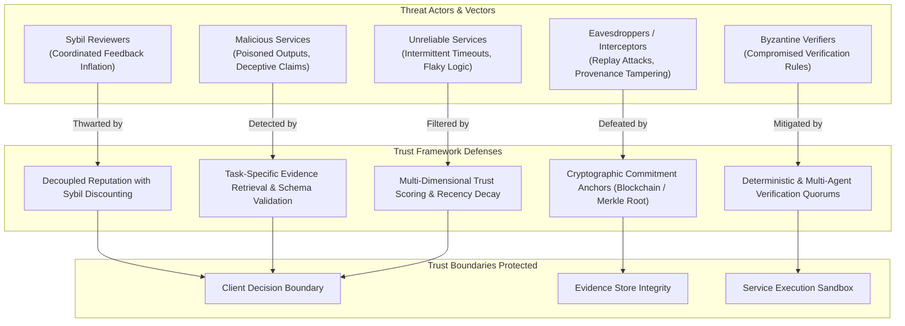

# Threat Model & Adversarial Analysis

This document provides a comprehensive threat model analyzing **14 distinct adversarial attack vectors** against autonomous service selection in decentralized multi-agent ecosystems.

---

## 1. Adversarial Modeling Framework

We adopt the STRIDE and MITRE ATT&CK paradigms adapted for multi-agent systems. Adversaries are modeled with varying capabilities:
- **Low-Capability:** Ephemeral unauthenticated endpoints, random latency spikes.
- **Medium-Capability:** Coordinated Sybil accounts, collusive rating syndicates, deceptive capability profiles.
- **High-Capability:** Byzantine service providers attempting prompt injection, payload poisoning, replay attacks, and provenance manipulation.

---

## 2. Comprehensive Analysis of the 14 Threat Vectors

---

### Threat 1: Malicious Service Provider
- **Attacker Capability:** Full control over service endpoint responses.
- **Attack:** Returns intentionally poisoned computational values, malicious prompt injections intended to compromise the client LLM, or hidden backdoors.
- **Impact:** Compromises downstream agent reasoning; causes financial or operational harm.
- **Current Mitigation:** Post-execution verification layer validates outputs inside an isolated sandbox before returning results to the client agent's main context.
- **Remaining Limitation:** Open-ended creative or subjective outputs cannot be deterministically verified for subtle factual manipulation.

---

### Threat 2: Unreliable / Degraded Service
- **Attacker Capability:** High stochastic variance in infrastructure, resource starvation, or model throttling.
- **Attack:** Unpredictable timeouts, intermittent HTTP 500 errors, or silent dropping of long requests.
- **Impact:** Exceeds task deadlines; depletes client execution tokens and retry budgets.
- **Current Mitigation:** Strict client-side timeout enforcement; automated generation of negative evidence records upon timeout; exponential moving average latency tracking.
- **Remaining Limitation:** Stochastic bursts of reliability can temporarily boost an unreliable agent's score before it fails again.

---

### Threat 3: Dishonest Reputation Ratings
- **Attacker Capability:** Ability to submit subjective ratings to public or on-chain reputation registries.
- **Attack:** Malicious reviewers post unfairly low ratings for honest competitors (bad-mouthing) and inflated ratings for affiliated services.
- **Impact:** Distorts global reputation signals.
- **Current Mitigation:** Global reputation is treated strictly as an untrusted prior ($\delta \cdot \rho_i$) and is heavily discounted whenever direct or verified evidence exists.
- **Remaining Limitation:** In zero-evidence cold-start scenarios, dishonest reputation can still bias initial candidate discovery.

---

### Threat 4: Coordinated Sybil Feedback Syndicates
- **Attacker Capability:** Creation of hundreds of disposable agent identities at negligible marginal cost.
- **Attack:** Sybil clusters cross-rate each other to artificially achieve near-perfect reputation scores (observed in 59–90% of ERC-8004 reviewers).
- **Impact:** Complete failure of reputation-only selection mechanisms.
- **Current Mitigation:** Sybil discount factor ($\delta \in [0.1, 0.3]$); requiring verified task-specific evidence records which require passing actual deterministic tests.
- **Remaining Limitation:** If Sybils perform and verify actual low-cost micro-tasks, they can generate valid task-specific evidence within low-complexity domains.

---

### Threat 5: Forged Evidence Records
- **Attacker Capability:** Fabricating interaction JSON records claiming high past success.
- **Attack:** An adversary presents fake evidence logs to the client agent to simulate historical competence.
- **Impact:** Misleads the Trust Evaluation Engine into trusting an unvetted service.
- **Current Mitigation:** Evidence records must match cryptographic state commitments (Merkle roots) previously anchored to an append-only ledger or signed by a verified verifier public key.
- **Remaining Limitation:** Requires client agents to periodically sync and verify ledger state roots.

---

### Threat 6: Replay of Historical Evidence
- **Attacker Capability:** Re-submitting authentic, valid historical evidence records from months prior.
- **Attack:** An agent that was reliable 6 months ago but has since degraded submits old evidence records to prove present competence.
- **Impact:** Masks current behavioral degradation.
- **Current Mitigation:** Strict exponential time-decay weighting ($e^{-\lambda \Delta t}$) that asymptotically zeroes out old records; mandatory Unix epoch timestamp validation.
- **Remaining Limitation:** Determining the optimal decay constant $\lambda$ requires balancing historical learning with rapid adaptation.

---

### Threat 7: Stale Evidence & Behavioral Drift
- **Attacker Capability:** Gradual degradation of model weights or operational infrastructure.
- **Attack:** Agent silently transitions from a frontier LLM to an inexpensive quantized model to cut hosting costs.
- **Impact:** Sub-surface quality degradation that passes basic schema checks.
- **Current Mitigation:** Sliding-window recency filtering; continuous post-execution testing; tracking rolling failure rates.
- **Remaining Limitation:** Subtle degradation on nuanced edge cases may accumulate multiple failures before the trust score crosses the rejection threshold.

---

### Threat 8: Misleading Capability Claims ("Cheap Talk")
- **Attacker Capability:** Publishing arbitrary OpenAPI / Agent Card metadata in public registries.
- **Attack:** A simple regex script advertises itself as a "Quantum-Resistant Cryptographic Solver."
- **Impact:** Client agent wastes time and network bandwidth selecting non-functional candidates.
- **Current Mitigation:** Capability matching is treated as a necessary pre-filter, but zero trust weight is derived from self-assertions.
- **Remaining Limitation:** Does not eliminate initial discovery overhead when probing non-functional endpoints.

---

### Threat 9: Verification Layer Manipulation
- **Attacker Capability:** Influencing or exploiting vulnerabilities in the verification logic.
- **Attack:** Returning outputs specifically crafted to exploit test suite weaknesses (e.g., returning hardcoded values that satisfy trivial assert statements).
- **Impact:** Produces false positive evidence records that poison the evidence store.
- **Current Mitigation:** Dynamic test input parameter generation (property-based testing / fuzzing); randomized verification test suites.
- **Remaining Limitation:** If the verification suite itself contains semantic bugs, the ground truth is corrupted.

---

### Threat 10: Service Impersonation
- **Attacker Capability:** Man-in-the-middle network interception or spoofing endpoint URIs.
- **Attack:** Malicious node pretends to be a reputable service provider by spoofing HTTP headers.
- **Impact:** Intercepts confidential task parameters; returns poisoned outputs.
- **Current Mitigation:** Cryptographic public key bindings (DID / Ed25519 signatures on task requests and responses); TLS certificate pinning.
- **Remaining Limitation:** Relies on robust local cryptographic key management.

---

### Threat 11: Evidence Store Poisoning
- **Attacker Capability:** Injecting bogus interaction records directly into a shared evidence repository.
- **Attack:** In collaborative multi-agent setups with shared vector stores, an adversary injects synthetic positive records for its own nodes.
- **Impact:** Corrupts semantic RAG retrieval across the entire agent fleet.
- **Current Mitigation:** Shared evidence ingestion requires verifying the cryptographic signature of the reporting client agent against an on-chain commitment.
- **Remaining Limitation:** Colluding client agents can still mutually attest to bogus interactions unless cross-validated.

---

### Threat 12: Compromised Autonomous Client Agent
- **Attacker Capability:** Root exploit or jailbreak prompt injection on the client agent runtime.
- **Attack:** Directly modifies local trust thresholds $\theta(R)$ or alters local SQLite database records.
- **Impact:** Complete failure of trust decision logic.
- **Current Mitigation:** Out of core framework boundary. Client agent host security is assumed (Assumption A1).
- **Remaining Limitation:** The framework cannot defend against an attacker who has full memory execution access to the host machine.

---

### Threat 13: Denial of Service (DoS) via Complex Tasks
- **Attacker Capability:** Rapidly sending computationally exhausting tasks or intentionally stalling responses.
- **Attack:** Malicious services accept tasks and hold connections open until the absolute timeout limit.
- **Impact:** Exhausts client worker threads and blocks execution queues.
- **Current Mitigation:** Strict per-request asynchronous timeout bounds; circuit-breaker pattern triggering automatic quarantine after 2 consecutive timeouts.
- **Remaining Limitation:** Network socket resource consumption during the initial timeout window.

---

### Threat 14: Manipulated Provenance Chains
- **Attacker Capability:** Modifying the timestamp or transaction hash in an off-chain evidence record.
- **Attack:** Altering failure records to appear as successful interactions from a different block height.
- **Impact:** Rewrites historical performance audit trails.
- **Current Mitigation:** Cryptographic hash integrity checks: $\text{Hash}(e_k) = \text{SHA-256}(\text{task} \parallel \text{result} \parallel \text{verdict} \parallel t_k)$; validated against anchored Merkle roots.
- **Remaining Limitation:** Detection is guaranteed upon audit, but performing cryptographic audits on every single task adds verification latency.
