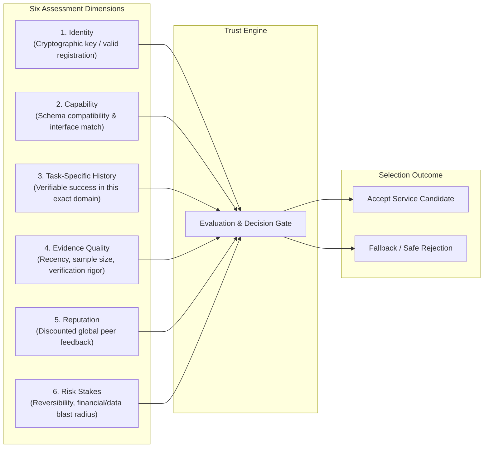

# Trust Model Specification

This document formalizes the theoretical foundations, conceptual taxonomy, and proposed algorithmic formulation of the **Trust Model** in the Trust-Aware Service Selection framework.

---

## 1. Conceptual Taxonomy: Clarifying Fundamental Concepts

To prevent ambiguity, we establish clear distinctions between concepts that are frequently conflated:

```text
┌─────────────────────────────────────────────────────────────────────────────┐
│  CONCEPTUAL MATRIX                                                          │
├───────────────────┬─────────────────────────────────────────────────────────┤
│ Concept           │ Formal Definition                                       │
├───────────────────┼─────────────────────────────────────────────────────────┤
│ Trust             │ A subjective, decision-oriented assessment of           │
│                   │ confidence that an entity will perform a specific task  │
│                   │ successfully under explicit risk constraints.           │
├───────────────────┼─────────────────────────────────────────────────────────┤
│ Reputation        │ A global, aggregate summary of third-party or peer      │
│                   │ ratings; non-contextual, socially constructed, and      │
│                   │ vulnerable to Sybil collusion.                          │
├───────────────────┼─────────────────────────────────────────────────────────┤
│ Evidence          │ Verifiable, empirical records of past task executions,   │
│                   │ including inputs, outputs, timestamps, and verdicts.    │
├───────────────────┼─────────────────────────────────────────────────────────┤
│ Task-Specific     │ Trust evaluated exclusively over the historical subset  │
│ Trust             │ of evidence that shares high semantic and structural    │
│                   │ similarity with the current task domain.                │
├───────────────────┼─────────────────────────────────────────────────────────┤
│ Verification      │ An objective evaluation process determining whether a   │
│                   │ task output satisfies correctness, schema, or safety   │
│                   │ specifications.                                         │
├───────────────────┼─────────────────────────────────────────────────────────┤
│ Risk              │ The magnitude of potential loss or harm resulting from   │
│                   │ service failure, factoring in reversibility and stakes. │
└───────────────────┴─────────────────────────────────────────────────────────┘
```

---

## 2. The Conceptual Relationship

The framework models the trust decision as a synthesis of six explicit dimensions:

$$\text{Identity} + \text{Capability} + \text{Task-Specific History} + \text{Evidence Quality} + \text{Reputation} + \text{Risk} \longrightarrow \text{Trust Decision}$$



- **Identity** establishes that the candidate service is cryptographically continuous across interactions and owns its identifier.
- **Capability** checks whether the service's advertised interface matches the task's required input/output schema.
- **Task-Specific History** provides the empirical foundation: how did this service perform on semantically similar tasks in the past?
- **Evidence Quality** discounts stale or unverified records and quantifies epistemic uncertainty based on sample volume.
- **Reputation** acts as a weak, discounted prior signal, preventing cold-start deadlock while guarding against Sybil inflation.
- **Risk** sets the required confidence threshold: high-stakes tasks require near-certainty, while low-stakes tasks tolerate exploratory delegation.

---

## 3. Algorithmic Formulation [PROPOSED MODEL]

> **IMPORTANT: PROPOSED MODEL NOTICE**  
> The mathematical formulations below represent the **PROPOSED MODEL** designed for the simulation testbed. They are not claimed as universal laws; their parameters ($\lambda, \gamma, \delta$) are subject to empirical sensitivity analysis and calibration during experiment execution.

### 3.1 Task-Specific Semantic Relevance Weighting
For an incoming task $T$ with domain embedding $\mathbf{v}_T$ and candidate service $S_i$, let $\mathcal{E}_i = \{e_1, \dots, e_m\}$ denote the historical evidence records. The weight $w_k$ of record $e_k$ is computed as:

$$w_k = \max\left(0, \cos(\mathbf{v}_T, \mathbf{v}_{e_k})\right) \cdot e^{-\lambda (t_{\text{current}} - t_k)}$$

where:
- $\cos(\mathbf{v}_T, \mathbf{v}_{e_k})$ measures semantic similarity between task specifications.
- $\lambda > 0$ is the time-decay parameter reflecting behavioral half-life.

### 3.2 Expected Historical Performance ($\mu_{\text{history}}$)
The empirical task performance expectation is computed as the weighted success rate:

$$\mu_{\text{history}}(S_i, T) = \frac{\sum_{k=1}^m w_k \cdot y_k \cdot q_k}{\sum_{k=1}^m w_k + \epsilon}$$

where:
- $y_k \in \{0, 1\}$ is the verification outcome ($1 = \text{Pass}, 0 = \text{Fail}$).
- $q_k \in [0, 1]$ is the verification rigor weight (e.g., $1.0$ for deterministic code execution, $0.5$ for heuristic checks).
- $\epsilon > 0$ is a small denominator smoothing constant.

### 3.3 Evidence Confidence & Uncertainty ($\Omega_i$)
Confidence in the historical estimate is modeled as an asymptotic concave function of effective evidence weight:

$$\Omega_i = 1 - e^{-\gamma \sum_{k=1}^m w_k}$$

where $\gamma > 0$ dictates the rate at which accumulated observations reduce uncertainty.

### 3.4 Multi-Factor Synthesis & Discounted Reputation
Let $\rho_i \in [0, 1]$ represent the candidate's reported global reputation score, and let $\delta \in [0, 1]$ be the Sybil discount factor (calibrated to reflect the 59–90% Sybil contamination observed in literature). The synthesized trust expectation $E(S_i, T)$ is:

$$E(S_i, T) = \Omega_i \cdot \mu_{\text{history}}(S_i, T) + (1 - \Omega_i) \cdot (\delta \cdot \rho_i)$$

### 3.5 Risk-Conditioned Decision Gating
Let $R \in [0, 1]$ represent the objective task risk. The required acceptance threshold $\theta(R)$ is a monotonic increasing function of risk:

$$\theta(R) = \theta_{\text{base}} + (1 - \theta_{\text{base}}) \cdot R$$

The candidate is admitted to the candidate selection pool if and only if:

$$\text{IdentityValid}(S_i) \wedge \text{CapabilityMatch}(S_i, T) \wedge \Big(E(S_i, T) \ge \theta(R)\Big) \wedge \Big(\Omega_i \ge \Omega_{\text{min}}(R)\Big)$$

If no candidate satisfies this criteria, the client agent executes a **Safe Rejection**, preventing delegation to high-risk or unverified providers.
