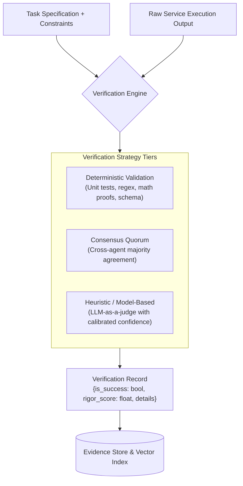

# Result Verification Model Specification

This document details the architecture, methodologies, and trust boundaries of the **Result Verification Layer**, which converts raw execution outcomes into empirical evidence records.

---

## 1. The Critical Role of Verification

Without verification, historical logs record only what an agent *claimed* or *returned*, with zero assurance of correctness or safety. The Result Verification Layer serves as the epistemic anchor of the framework:

$$\text{Raw Execution Output} \xrightarrow{\text{Verification Engine}} \text{VerificationRecord} \xrightarrow{\text{Evidence Store}} \text{Updated Trust Assessment}$$



---

## 2. Verification Methodologies

The framework supports three verification tiers based on task nature and risk stakes:

### 2.1 Deterministic Verification (Rigor: $q = 1.0$)
- **Applicable Domains:** Code generation, mathematical calculations, schema transformations, SQL queries, cryptographic signature validation.
- **Mechanism:** The verifier executes unit tests inside an isolated sandbox (e.g., executing Python `assert` tests), checks formal type constraints, or validates output against a deterministic oracle.
- **Confidence:** Highest epistemic certainty ($q = 1.0$). If an output fails unit tests, it is marked as a definitive failure ($y = 0$).

### 2.2 Consensus / Quorum Verification (Rigor: $q = 0.85$)
- **Applicable Domains:** Data retrieval, web extraction, classification, multi-source synthesis.
- **Mechanism:** The client agent dispatches the query to $k$ independent candidate agents ($k \ge 3$) and computes similarity/overlap across returned outputs.
- **Confidence:** High, provided the independent agents do not share a common failure mode or collusive ownership.

### 2.3 Heuristic / Semantic Evaluation (Rigor: $q = 0.50$)
- **Applicable Domains:** Natural language summarization, creative drafting, subjective reasoning.
- **Mechanism:** Evaluated using a local, aligned referee model checking specific rubric criteria (factual consistency, avoidance of toxic tokens, prompt compliance).
- **Confidence:** Moderate ($q = 0.50$). Due to potential judge hallucinations, semantic evaluations are discounted when computing historical competence.

---

## 3. The Verifier Trust Boundary: "Who Verifies the Verifier?"

A fundamental question in computational trust is: *What prevents the verifier itself from being compromised or introducing errors?*

```text
┌─────────────────────────────────────────────────────────────────────────────┐
│  VERIFIER TRUST BOUNDARY ANALYSIS                                           │
├───────────────────┬─────────────────────────────────────────────────────────┤
│ Threat Scenario   │ Impact & Mitigation                                     │
├───────────────────┼─────────────────────────────────────────────────────────┤
│ 1. Flawed Test    │ Test assertions fail correct outputs (false failure).   │
│    Suite          │ Mitigation: Tests must be validated deterministically   │
│                   │ on known gold-standard inputs during task definition.   │
├───────────────────┼─────────────────────────────────────────────────────────┤
│ 2. Byzantine /    │ Verifier falsely reports success for malicious output.  │
│    Malicious      │ Mitigation: The verifier runs locally within the        │
│    Verifier       │ client agent's trusted boundary. In distributed setups, │
│                   │ multi-verifier consensus or zero-knowledge proofs      │
│                   │ are required.                                           │
├───────────────────┼─────────────────────────────────────────────────────────┤
│ 3. Non-           │ Open-ended tasks produce valid outputs not captured by  │
│    Deterministic  │ rigid tests.                                            │
│    Valid Outputs  │ Mitigation: Assign lower verification rigor ($q = 0.50$) │
│                   │ to prevent penalizing alternative valid solutions.      │
└───────────────────┴─────────────────────────────────────────────────────────┘
```

---

## 4. Verification Cost vs. Confidence Trade-off

Verification incurs execution latency and compute expenditure. The framework balances this trade-off via **Risk-Conditioned Verification Routing**:
- **Low Stakes ($R \le 0.3$):** Rapid schema check only; minimal latency ($< 5$ ms).
- **Medium Stakes ($0.3 < R \le 0.7$):** Deterministic unit test execution; moderate latency ($50 - 200$ ms).
- **High / Critical Stakes ($R > 0.7$):** Comprehensive sandboxed test suite + cryptographic provenance validation; higher latency ($200 - 1000$ ms).
