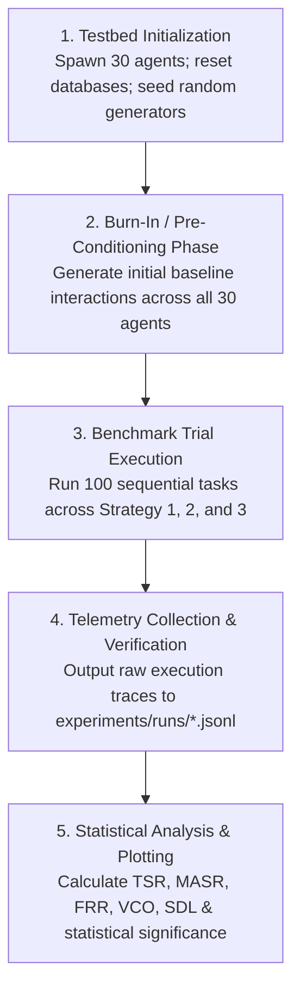

# Experiment Execution Protocol

This document details the step-by-step protocol for conducting controlled simulation runs, detailing trial progression, burn-in phases, state logging, and statistical validation.

---

## 1. Experimental Stages

The experimental trial workflow progresses through five deterministic stages:

---

## 2. Step-by-Step Protocol

### Stage 1: Environment Initialization
1. Ensure Python 3.10+ virtual environment is active.
2. Verify all test suites pass (`pytest tests/`).
3. Clean output directories (`experiments/runs/` and `experiments/results/`).
4. Initialize pseudorandom seeds across `numpy`, `random`, and task generators (`seed = 42`).

### Stage 2: Burn-In / Pre-Conditioning Phase
- Prior to recording benchmark metrics, the testbed executes a pre-conditioning sequence of **50 generic tasks**.
- Purpose: Populates the global reputation registry (allowing honest agents to accumulate baseline ratings and malicious Sybil rings to inflate their public score to $\rho \in [0.93, 0.99]$), establishing realistic initial market conditions.

### Stage 3: Benchmark Trial Execution
- The workload generator feeds **100 sequential tasks** from `experiments/datasets/benchmark_tasks.jsonl`.
- The runner evaluates the exact same task sequence three times:
  - **Run A:** Strategy 1 (Random Selection).
  - **Run B:** Strategy 2 (Reputation-Only Selection).
  - **Run C:** Strategy 3 (Evidence-Based Selection).
- In each trial:
  1. Discovery identifies reachable candidates.
  2. The strategy selects candidate $S^*$.
  3. $S^*$ executes the task; latency is recorded.
  4. Verification Layer evaluates output correctness.
  5. The evidence store and metrics collector log the trial outcome.

### Stage 4: Statistical Significance Testing
- Compute mean and variance for all 5 metrics across 10 repeated runs (using seeds 42 through 51).
- Perform **Wilcoxon Signed-Rank Tests** (paired non-parametric comparison) between Strategy 3 and Strategy 2 on $TSR$ and $MASR$ with significance threshold $\alpha = 0.05$.
