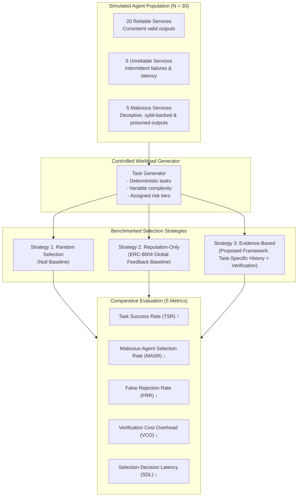

# Controlled Experimental Design Specification

This document formalizes the experimental design, simulation parameters, behavioral population controls, and scientific methodology developed to evaluate the **Trust-Aware Service Selection Framework**.

---

## 1. Experimental Methodology Overview

---

## 2. Experimental Environment: 30 Heterogeneous Service Agents

The testbed simulates a closed, reproducible population of **$N = 30$ service agents** divided into three operational behavioral classes:

| Class | Count | Proportion | Operational Behavioral Definition |
|---|---|---|---|
| **Reliable** | 20 | 66.7% | Consistently schema-compliant, high availability ($P(\text{available}) \ge 0.98$), deterministic execution accuracy ($P(\text{correct}) \ge 0.96$), low execution latency ($\mu = 120$ ms, $\sigma = 15$ ms). |
| **Unreliable** | 5 | 16.7% | Stochastic execution degradation: high latency variance ($\mu = 450$ ms, $\sigma = 200$ ms), intermittent timeouts ($P(\text{timeout}) = 0.25$), intermittent schema corruption ($P(\text{error}) = 0.30$). |
| **Malicious** | 5 | 16.7% | Adversarial operation: active participation in Sybil rating rings to inflate raw reputation ($\rho_i \in [0.90, 0.99]$), conditional payload poisoning, subtle mathematical corruption, or prompt injection on high-stakes tasks. |

---

## 3. The Experimental Unit

The atomic unit of empirical analysis is a **Service-Selection Trial** $(\tau)$:
$$\tau = \langle \text{task\_id}, T, \mathcal{C}, \mathcal{S}, S^*, y, t_{\text{exec}}, \text{verdict} \rangle$$
where:
- $T$: The task specification including domain embedding $\mathbf{v}_T$ and risk tier $R$.
- $\mathcal{C} \subseteq \{S_1, \dots, S_{30}\}$: The set of discovered candidate agents advertising capability for $T$.
- $\mathcal{S} \in \{\text{Random}, \text{Reputation-Only}, \text{Evidence-Based}\}$: The active selection strategy.
- $S^*$: The service agent selected (or `REJECT`).
- $y \in \{0, 1\}$: The objective execution outcome.
- $t_{\text{exec}}$: The wall-clock execution and selection latency.
- $\text{verdict}$: The structured output produced by the Verification Layer.

---

## 4. Workload Characteristics & Task Distribution

The experiment subjects all three strategies to an identical stream of **100 sequentially generated tasks** across 5 distinct domains:
1. `math_computation`: Exact numerical evaluations and equation solving.
2. `code_execution`: Python algorithm execution against unit tests.
3. `schema_transformation`: Complex JSON-to-YAML/Relational schema conversions.
4. `sql_generation`: Query generation evaluated against an in-memory SQLite schema.
5. `text_classification`: Deterministic multi-label classification against labeled ground truth.

Each task is deterministically assigned a risk tier:
- **Low Stakes ($R = 0.2$):** 40% of tasks.
- **Medium Stakes ($R = 0.5$):** 35% of tasks.
- **High Stakes ($R = 0.85$):** 25% of tasks.
