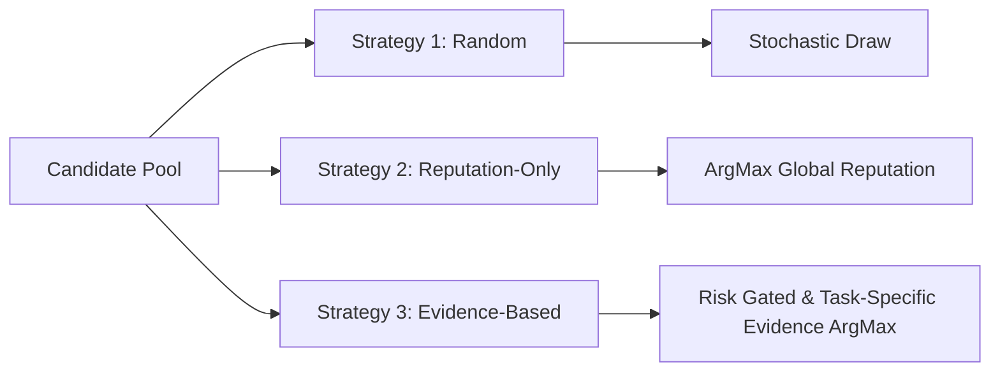

# Experimental Selection Strategies

This document formalizes the execution algorithms for the three selection strategies benchmarked in the experiment: **Random Selection**, **Reputation-Only Selection**, and **Evidence-Based Selection**.

---

## 1. Mathematical Formalism of Selection Strategies

For any given task trial $\tau$ with task specification $T = (\mathbf{v}_T, R)$, the candidate discovery module returns candidate set $\mathcal{C} = \{S_1, \dots, S_n\}$.



---

## 2. Strategy 1: Random Selection Algorithm

```python
def select_random(candidates: list[ServiceMetadata], task: TaskSpecification) -> str:
    """
    Null baseline: Uniformly selects a reachable candidate.
    """
    reachable = [c for c in candidates if c.is_reachable]
    if not reachable:
        return "REJECT"
    return random.choice(reachable).service_id
```

- **Computational Complexity:** $\mathcal{O}(1)$
- **Decision Latency:** $< 0.1$ ms
- **Underlying Hypothesis:** Represents random exploration without institutional memory. Will exhibit failure rates directly proportional to the presence of unreliable and malicious agents in the candidate pool.

---

## 3. Strategy 2: Reputation-Only Selection Algorithm

```python
def select_reputation_only(candidates: list[ServiceMetadata], task: TaskSpecification) -> str:
    """
    Industry baseline (ERC-8004 style):
    Selects candidate with the highest global aggregate reputation.
    """
    reachable = [c for c in candidates if c.is_reachable]
    if not reachable:
        return "REJECT"
    
    # Sort descending by raw public reputation score rho
    best_candidate = max(reachable, key=lambda c: c.raw_reputation_score)
    return best_candidate.service_id
```

- **Computational Complexity:** $\mathcal{O}(|\mathcal{C}|)$
- **Decision Latency:** $< 1.0$ ms
- **Underlying Hypothesis:** Because malicious agents participate in Sybil feedback syndicates ($\rho \in [0.93, 0.99]$), Strategy 2 will be systematically deceived and exhibit a disproportionately high Malicious-Agent Selection Rate ($MASR$).

---

## 4. Strategy 3: Evidence-Based Selection Algorithm

```python
def select_evidence_based(
    candidates: list[ServiceMetadata],
    task: TaskSpecification,
    evidence_store: EvidenceStore,
    trust_evaluator: TrustEvaluator,
    risk_assessor: RiskAssessor
) -> tuple[str, str]:
    """
    Proposed Framework:
    Filters and ranks candidates using task-specific verified interaction history,
    semantic RAG matching, evidence quality, and risk gating.
    """
    risk_assessment = risk_assessor.assess(task)
    theta_risk = risk_assessment.confidence_threshold
    omega_min = risk_assessment.min_evidence_confidence
    
    qualified_candidates = []
    
    for candidate in candidates:
        if not candidate.is_reachable or not candidate.identity_valid:
            continue
            
        # 1. Retrieve task-specific evidence via semantic vector search (RAG)
        evidence_records = evidence_store.query_evidence(
            service_id=candidate.service_id,
            task_domain=task.domain,
            task_embedding=task.embedding
        )
        
        # 2. Evaluate multidimensional trust
        assessment = trust_evaluator.evaluate(
            candidate=candidate,
            task=task,
            evidence=evidence_records,
            risk=risk_assessment
        )
        
        # 3. Gating check: Must meet risk threshold
        if assessment.confidence >= omega_min and assessment.expected_success >= theta_risk:
            qualified_candidates.append((candidate.service_id, assessment.expected_success))
            
    if not qualified_candidates:
        # Safe Rejection: Prevent high-stakes damage
        return "REJECT", "No candidate satisfied the risk-calibrated confidence threshold"
        
    # 4. Select candidate with highest task-specific expectation
    best_service_id, _ = max(qualified_candidates, key=lambda x: x[1])
    return best_service_id, "Selected via task-specific verified evidence"
```

- **Computational Complexity:** $\mathcal{O}(|\mathcal{C}| \cdot K \cdot d)$ (where $K$ is retrieved records, $d$ is embedding dimension).
- **Decision Latency:** $15 - 50$ ms.
- **Underlying Hypothesis:** Successfully identifies and rejects Sybil-inflated malicious agents by observing zero verified task successes in the requested domain, achieving higher overall task success.
