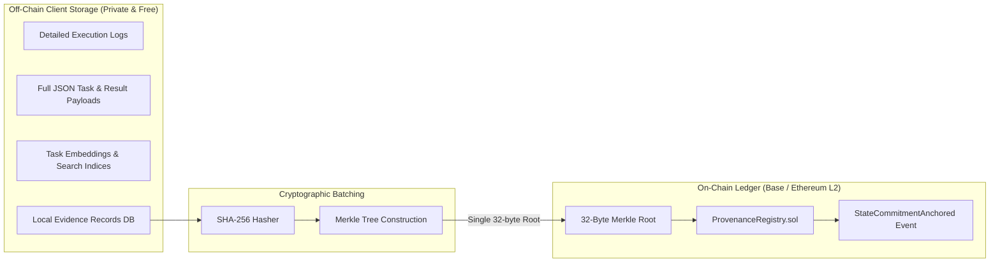

# Blockchain Integration & Provenance Commitments

This document specifies the cryptographic architecture, smart contract interfaces, gas optimization, and storage boundaries for **Blockchain and Decentralized Ledger Integration**.

---

## 1. The Explicit Role of the Blockchain

In this architecture, the blockchain is utilized strictly as a **tamper-evident cryptographic commitment and provenance anchor**. It is deliberately **NOT** used as an execution environment for AI models, nor as a replacement for client-side decision logic.



---

## 2. On-Chain vs. Off-Chain Partitioning

```text
┌─────────────────────────────────────────────────────────────────────────────┐
│  DATA PARTITIONING                                                          │
├──────────────────────────────────────┬──────────────────────────────────────┤
│ What Stays OFF-CHAIN                 │ What Goes ON-CHAIN                   │
├──────────────────────────────────────┼──────────────────────────────────────┤
│ • Full task prompts and code payloads│ • 32-byte SHA-256 Merkle Root        │
│ • Large stack traces & debug telemetry│ • Batch sequence number & timestamp  │
│ • Vector embeddings (float arrays)   │ • Cryptographic signature of agent   │
│ • Private API keys & credentials     │ • Smart contract state event receipt │
├──────────────────────────────────────┼──────────────────────────────────────┤
│ Why: High speed, zero transaction    │ Why: Post-hoc tamper-evidence,       │
│      fees, absolute privacy.         │      permanent unalterable audit log.│
└──────────────────────────────────────┴──────────────────────────────────────┘
```

---

## 3. Gas & Economic Cost Considerations

- **The Problem of Direct On-Chain Writes:** In naive implementations, storing a 2 KB JSON evidence record on Ethereum mainnet costs upwards of \$15–\$50 in gas. Storing thousands of records creates an economically unviable system.
- **Our Batch Commitment Solution:**
  - The client agent batches $B = 100$ verified evidence records locally.
  - Generates a Merkle tree of leaf hashes:
    $$h_k = \text{SHA-256}(e_k)$$
  - Commits only the **32-byte Merkle root** to an EVM Layer 2 (e.g., Base or Optimism) smart contract via a single `anchorStateCommitment(bytes32 root)` call.
  - **Marginal Cost:** Less than \$0.001 per task trial on Base L2.

---

## 4. Smart Contract Interface (`ProvenanceRegistry.sol`) [PROPOSED]

```solidity
// SPDX-License-Identifier: MIT
pragma solidity ^0.8.20;

/**
 * @title ProvenanceRegistry
 * @notice Immutable append-only anchor for agent evidence state commitments.
 */
contract ProvenanceRegistry {
    struct StateCommitment {
        bytes32 merkleRoot;
        uint256 timestamp;
        uint256 recordCount;
        address clientAgent;
    }

    event StateCommitmentAnchored(
        bytes32 indexed merkleRoot,
        address indexed clientAgent,
        uint256 timestamp,
        uint256 recordCount
    );

    // Mapping from Merkle root to StateCommitment record
    mapping(bytes32 => StateCommitment) public commitments;

    function anchorCommitment(bytes32 _merkleRoot, uint256 _recordCount) external {
        require(commitments[_merkleRoot].timestamp == 0, "Commitment already exists");

        commitments[_merkleRoot] = StateCommitment({
            merkleRoot: _merkleRoot,
            timestamp: block.timestamp,
            recordCount: _recordCount,
            clientAgent: msg.sender
        });

        emit StateCommitmentAnchored(_merkleRoot, msg.sender, block.timestamp, _recordCount);
    }
}
```

---

## 5. What Blockchain Does NOT Solve

1. **Garbage In, Garbage Out:** If an unverified or corrupted result is hashed into a Merkle root, the blockchain will faithfully record the hash. Immutability guarantees *integrity of the record*, not *truthfulness of the agent's work*.
2. **Real-Time Decision Gating:** Waiting for block confirmation (2 to 12 seconds) prior to task dispatch violates real-time latency budgets. All real-time trust decisions use local cached evidence, with blockchain commitments occurring asynchronously in the background.
