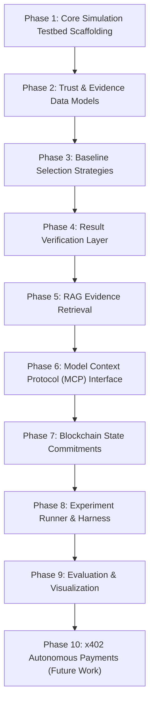

# Staged Implementation Plan (Phases 1–10)

This document specifies the 10-phase engineering and research roadmap for the **Trust-Aware Service Selection Framework**, detailing objectives, inputs, outputs, dependencies, files, and acceptance criteria for every phase.

---

## 1. Phased Architecture Overview

---

## 2. Phase-by-Phase Specification

### Phase 1: Core Simulation Testbed Scaffolding
- **Objective:** Create the foundational Python environment, package structure, and base agent abstractions.
- **Inputs:** `requirements.txt`, `project.yaml`.
- **Outputs:** Functional base classes for client and service agents.
- **Files:** `src/__init__.py`, `src/services/base.py`, `src/agent/client_agent.py`.
- **Acceptance Criteria:** Base agents initialize, handle mock requests, and log events cleanly.

### Phase 2: Trust & Evidence Data Models
- **Objective:** Formalize typed data structures for all framework entities.
- **Inputs:** Entity specifications from system design documents.
- **Outputs:** Validated Pydantic models with serialization and schema generation.
- **Files:** `src/data_models.py`.
- **Acceptance Criteria:** All models (`Agent`, `Task`, `Evidence`, `VerificationRecord`, `TrustAssessment`) instantiate and validate constraints with 100% test coverage.

### Phase 3: Baseline Selection Strategies
- **Objective:** Implement Strategy 1 (Random Selection) and Strategy 2 (Reputation-Only Selection).
- **Inputs:** Candidate agent pools with assigned behavioral profiles.
- **Outputs:** Functional selection engine generating candidate choices based on uniform random and global reputation algorithms.
- **Files:** `src/selection/strategies.py`.
- **Acceptance Criteria:** Strategy 1 selects candidates with uniform probability; Strategy 2 strictly picks the highest raw reputation score.

### Phase 4: Result Verification Layer
- **Objective:** Build deterministic test runners and schema validators for returned task results.
- **Inputs:** `TaskSpecification` and `RawExecutionResponse`.
- **Outputs:** Structured `VerificationRecord` indicating pass/fail status and verification rigor score.
- **Files:** `src/verification/verifier.py`.
- **Acceptance Criteria:** Accurately catches schema corruption, timeouts, and assertion failures in sub-process execution.

### Phase 5: RAG Evidence Retrieval
- **Objective:** Implement vector embeddings and semantic cosine similarity retrieval over historical evidence.
- **Inputs:** Task specification description and local SQLite/DuckDB evidence records.
- **Outputs:** Top-$K$ evidence records matching the current task's domain.
- **Files:** `src/evidence/store.py`, `src/rag/retriever.py`.
- **Acceptance Criteria:** Successfully retrieves relevant historical records for a given task domain with $< 20$ ms latency.

### Phase 6: Model Context Protocol (MCP) Tool Integration
- **Objective:** Wrap trust evaluation, verification, and service invocation into standardized MCP tool endpoints.
- **Inputs:** MCP protocol specification (Anthropic 2024).
- **Outputs:** MCP server exposing `verify_agent`, `get_task_specific_trust`, `verify_result`, `record_interaction`, and `check_risk`.
- **Files:** `src/mcp/tools.py`.
- **Acceptance Criteria:** JSON-RPC tool endpoints adhere to MCP draft specification and handle error conditions gracefully.

### Phase 7: Blockchain State Commitments & Provenance
- **Objective:** Implement cryptographic hashing, Merkle tree batching, and tamper-evident ledger commitments.
- **Inputs:** Batches of `EvidenceRecord` objects.
- **Outputs:** 32-byte SHA-256 Merkle root committed to simulated/EVM smart contract storage.
- **Files:** `src/blockchain/provenance.py`.
- **Acceptance Criteria:** Merkle proofs verify that an evidence record exists within an anchored commitment; detects any post-hoc alteration.

### Phase 8: Experiment Runner & Testbed Harness
- **Objective:** Build the automated simulation harness coordinating 30 agents, 100 tasks, and 3 comparative strategies.
- **Inputs:** `experiments/configs/default_simulation.yaml`.
- **Outputs:** Raw telemetry and structured JSONL logs in `experiments/runs/`.
- **Files:** `src/experiment/runner.py`.
- **Acceptance Criteria:** Executes deterministic runs across all 3 strategies with identical task inputs under seed control.

### Phase 9: Evaluation, Statistical Analysis, & Visualization
- **Objective:** Compute the 5 core evaluation metrics ($TSR, MASR, FRR, VCO, SDL$) and generate statistical significance reports.
- **Inputs:** Raw trial logs from `experiments/runs/`.
- **Outputs:** Summary tables, CSV metrics, and paired Wilcoxon signed-rank test results.
- **Files:** `src/experiment/metrics.py`, `scripts/experiment/analyze_results.py`.
- **Acceptance Criteria:** Automatically generates formatted tables and $p$-values without manual intervention.

### Phase 10: x402 Autonomous Micropayments [FUTURE WORK]
- **Objective:** Integrate HTTP 402 payment settlement conditional on verified execution.
- **Inputs:** `VerificationRecord(is_success=True)`.
- **Outputs:** Automated escrow release transaction to service provider wallet.
- **Files:** `src/blockchain/payments_x402.py` (Planned).
- **Acceptance Criteria:** Zero payment released on failed or unverified tasks; escrow auto-refunded upon timeout.
