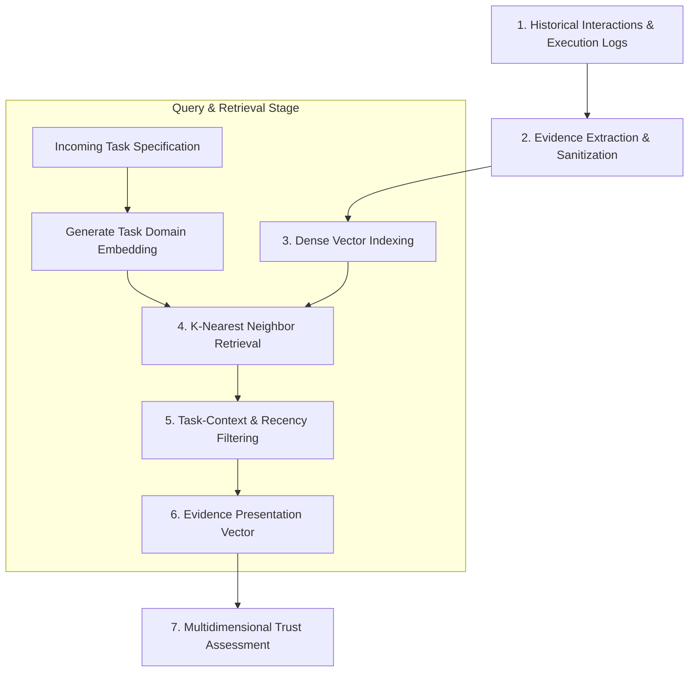

# RAG Evidence Retrieval Pipeline Specification

This document details the architecture, indexing strategies, vector retrieval mechanics, and failure safeguards of the **Retrieval-Augmented Generation (RAG) Evidence Pipeline**.

---

## 1. End-to-End RAG Evidence Flow

The RAG pipeline operates as a specialized contextual filter connecting raw historical interaction storage with the mathematical Trust Evaluation Engine:



---

## 2. Indexing Strategy: What Gets Indexed vs. What Does Not

### 2.1 Retrieval Units & Document Structure
Each retrieval unit corresponds to a single verified `EvidenceRecord`. To maintain high semantic resolution and eliminate noise:

```text
┌─────────────────────────────────────────────────────────────────────────────┐
│  INDEXED VECTOR PAYLOAD                                                     │
├─────────────────────────────────────────────────────────────────────────────┤
│  Dense Vector Embedding (384-dim):                                          │
│  Generated from: "[domain] | [subtask_type] | [abstracted_input_schema]"    │
│                                                                             │
│  Filtered Metadata:                                                         │
│  • service_id: Candidate service identifier                                 │
│  • task_domain: Coarse domain tag (e.g., "code_execution")                  │
│  • timestamp: Unix epoch timestamp                                          │
│  • is_success: Binary verification outcome (True / False)                   │
│  • rigor_score: Verification rigor float [0.0 - 1.0]                        │
│  • provenance_hash: 32-byte SHA-256 hash                                    │
└─────────────────────────────────────────────────────────────────────────────┘
```

### 2.2 What Does NOT Get Indexed in Vector Space
- **Raw Argument Values:** Specific proprietary data or parameters are omitted to preserve privacy and prevent vector pollution.
- **Large Stack Traces:** Execution errors are indexed by categorized error code rather than thousand-line raw logs.

---

## 3. Handling Nuanced Evidence Challenges

### 3.1 Task Relevance & Cosine Thresholds
A historical record is considered relevant if and only if:
$$\cos(\mathbf{v}_T, \mathbf{v}_{e_k}) \ge \tau_{\text{relevance}} \quad (\text{default } \tau = 0.65)$$
Evidence below this threshold is rejected as non-relevant, preventing performance on text tasks from biasing mathematical code selection.

### 3.2 Stale Evidence & Time Decay
Agent models degrade or improve over time. The pipeline enforces exponential time decay:
$$w_{\text{time}} = e^{-\lambda (t_{\text{current}} - t_{\text{record}})}$$
Records older than 90 days have negligible influence unless no recent evidence exists.

### 3.3 Conflicting Evidence Records
When evidence records for a single candidate service contain both successes and failures within the same domain:
- The pipeline does **NOT** average them indiscriminately.
- It clusters records by verification rigor ($q = 1.0$ deterministic vs. $q = 0.5$ heuristic). High-rigor failures take precedence over low-rigor successes.
- Recent failures receive higher recency weight, immediately detecting performance drift.

### 3.4 Hallucination Risks & Safeguards
- **RAG Output is NOT Automatically Trustworthy:** The vector database could experience index corruption or retrieval errors.
- **Verification Guarantee:** Every retrieved evidence ID is cross-referenced against the local SQLite primary key and verified against the local Merkle root before being fed into the Trust Evaluation Engine.
