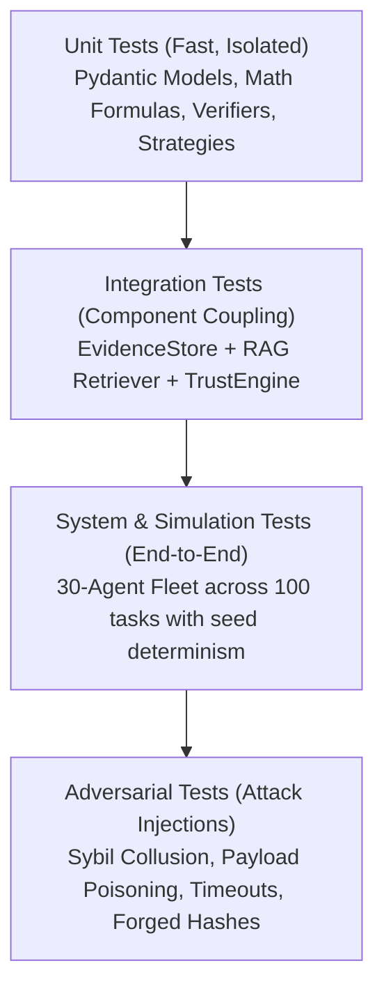

# Testing & Quality Assurance Strategy

This document details the multi-tiered testing strategy designed to validate data integrity, trust calculations, selection mechanics, and verification pipelines across the codebase.

---

## 1. Testing Pyramid Architecture



---

## 2. Test Suite Breakdown

### 2.1 Unit Tests (`tests/unit/`)
- `test_models.py`: Validates Pydantic schema serialization, type bounds, and validation errors for `TaskSpecification`, `EvidenceRecord`, and `TrustAssessment`.
- `test_trust.py`: Verifies mathematical edge cases of the Trust Evaluation Engine:
  - Division by zero protection when evidence volume is zero.
  - Asymptotic behavior of confidence function ($\Omega_i \to 1$ as sample size increases).
  - Time-decay discounting of aged records.
- `test_selection.py`: Verifies that Strategy 1 (Random), Strategy 2 (Reputation), and Strategy 3 (Evidence) adhere to their respective decision functions.
- `test_verification.py`: Validates that deterministic sandboxes correctly catch code syntax errors, assertion failures, and schema corruptions.

### 2.2 Integration Tests (`tests/integration/`)
- `test_evidence_pipeline.py`: Validates the complete cycle: `VerificationRecord` $\to$ `insert_evidence()` $\to$ SQLite commit $\to$ vector index update $\to$ RAG query.
- `test_blockchain_provenance.py`: Validates Merkle tree leaf hashing, root calculation, and tamper-detection proofs.

### 2.3 System & Simulation Tests (`tests/system/`)
- `test_simulation_dry_run.py`: Executes a deterministic 10-task trial on a 30-agent population to verify end-to-end telemetry generation and zero unhandled exceptions.

### 2.4 Adversarial Injection Tests
- `test_sybil_resilience.py`: Tests that an agent with $\rho = 0.99$ (Sybil inflated) but zero verified task evidence is rejected on high-stakes tasks by Strategy 3.
- `test_bait_and_switch.py`: Simulates an agent that behaves reliably on 10 low-stakes tasks and attempts payload poisoning on task 11; verifies that the failure is caught and immediately penalizes subsequent selection probability.

---

## 3. Test Execution Commands

```bash
# Run all unit tests with verbose output
pytest tests/unit/ -v

# Run integration tests
pytest tests/integration/ -v

# Run full suite with coverage report
pytest --cov=src tests/ --cov-report=term-missing
```
