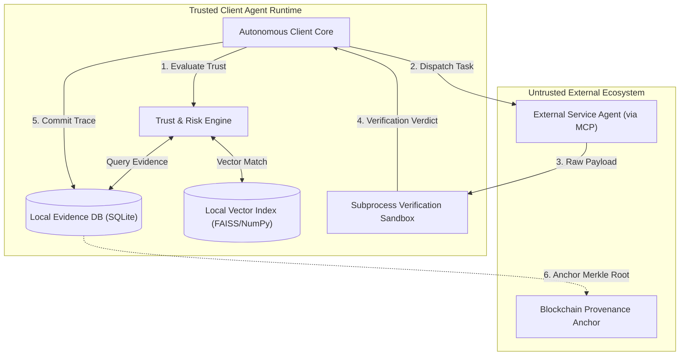

# Deep-Dive Technical Architecture Explanation

This document is prepared for software engineers, systems architects, and technical judges who want an in-depth breakdown of the technical design, data structures, and trust boundaries.

---

## 1. Architectural Philosophy: Zero Trust in Tool Execution

The architectural core of this framework is founded on the principle of **Zero Trust in External Agent Delegation**:
- An external service agent is treated as an **untrusted, potentially adversarial third-party RPC endpoint**.
- Communication occurs over standard Model Context Protocol (MCP) JSON-RPC transports.
- No external payload is permitted into the client agent's main reasoning context or system execution loop without passing through an **isolated verification sandbox**.

---

## 2. Component Interactions & Protocol Handshakes

### 2.1 Discovery & Candidate Pre-Filtering
- Client agent receives a task with domain tag and JSON Schema specification.
- Discovery queries available endpoints. Any endpoint failing a preliminary reachability probe (HTTP OPTIONS or ping $> 1500$ ms) is filtered out immediately.

### 2.2 RAG-Based Evidence Retrieval
- The task description is embedded into a 384-dimensional vector $\mathbf{v}_T$.
- The Vector Retriever performs top-$K$ cosine similarity search over local historical interaction records for each candidate.
- Records with cosine similarity $< 0.65$ are discarded. Surviving records are decayed exponentially based on age: $w = \cos \cdot e^{-\lambda \Delta t}$.

### 2.3 Multi-Dimensional Trust Calculation
- The Trust Evaluation Engine aggregates:
  - Valid cryptographic signature check.
  - Weighted empirical historical success rate $\mu_{\text{history}}$.
  - Evidence volume confidence $\Omega_i = 1 - e^{-\gamma \sum w}$.
  - Discounted public reputation: $\delta \cdot \rho_i$ ($\delta = 0.25$).
- If no candidate satisfies the risk threshold $\theta(R)$, the system triggers a **Safe Rejection**.

### 2.4 Execution & Sandboxed Verification
- Task parameters are formatted as MCP `tools/call` arguments.
- The returned payload is passed to `src/verification/verifier.py`, which executes deterministic unit tests inside an isolated Python subprocess with CPU and memory limits.
- The outcome is packaged into an immutable `EvidenceRecord`.

### 2.5 Cryptographic Anchoring
- Batches of 50 to 100 evidence records are hashed into a Merkle tree.
- The 32-byte Merkle root is committed to smart contract storage on an EVM Layer 2 (e.g., Base), creating an immutable, non-repudiable audit trail.
