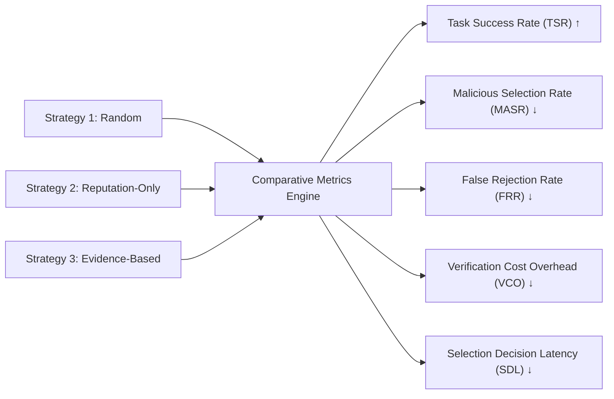

# Deep-Dive Research Methodology Explanation

This document is prepared for academic professors, reviewers, and AI research scientists seeking an in-depth breakdown of the experimental design, variable controls, and statistical rigor.

---

## 1. Scientific Formulation

We evaluate the service selection decision as an instance of **Contextual Decision-Making Under Epistemic Uncertainty**.

```text
Decision Problem:
Given task T = (v_T, R) and candidate pool C = {S_1, ..., S_n},
find selection policy π(T, C) -> S* that maximizes expected utility U(T, S*),
subject to minimizing risk-weighted catastrophic failure.
```

---

## 2. Experimental Controls & Population Dynamics

To isolate the causal effect of **task-specific evidence vs. reputation-only scoring**, all confounding variables are held constant:

1. **Identical Task Sequence:** All three strategies evaluate the identical 100-task stream in the identical sequential order.
2. **Fixed Heterogeneous Fleet ($N = 30$):**
   - **20 Reliable Agents (66.7%):** Low latency, $96\%$ accuracy.
   - **5 Unreliable Agents (16.7%):** Intermittent timeouts ($25\%$), high variance.
   - **5 Malicious Agents (16.7%):** Artificially inflated reputation ($\rho \in [0.93, 0.99]$) via Sybil rings; conditional bait-and-switch poisoning on high-stakes tasks.
3. **Pre-Conditioning Phase:** 50 burn-in tasks populate the reputation registry prior to benchmark evaluation, ensuring reputation scores reflect equilibrium conditions before measurement begins.

---

## 3. The Five Core Metrics & Hypotheses



### Formal Hypotheses
- **$\mathbf{H_1}$ (Security / Sybil Resilience):** $MASR(\mathcal{S}_{\text{evidence}}) < MASR(\mathcal{S}_{\text{rep}})$.
- **$\mathbf{H_2}$ (Operational Efficacy):** $TSR(\mathcal{S}_{\text{evidence}}) > TSR(\mathcal{S}_{\text{rep}})$.
- **$\mathbf{H_3}$ (Overhead Trade-off):** $SDL(\mathcal{S}_{\text{evidence}}) > SDL(\mathcal{S}_{\text{rep}})$ and $VCO > 0$.

---

## 4. Statistical Validation Protocol

To confirm statistical significance:
- The experiment is repeated across **10 independent random seeds** (seeds 42 through 51).
- We apply the **Wilcoxon Signed-Rank Test** (a non-parametric paired difference test) to evaluate whether reductions in $MASR$ and improvements in $TSR$ are statistically significant at $\alpha = 0.05$.
- We compute effect sizes using Cliff's delta ($\delta$) to quantify the magnitude of the difference independent of sample size.
