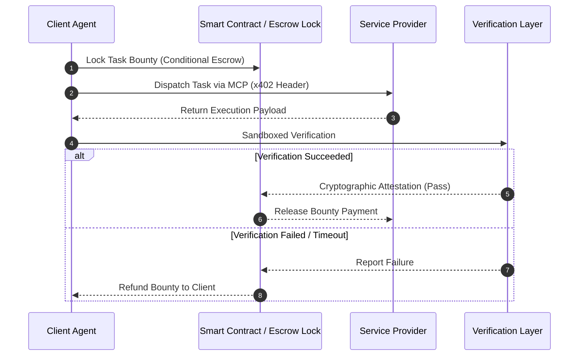

# Future Work & Extensions Roadmap

This document details planned research and engineering extensions, with special focus on **autonomous payment integration via x402** and cryptographic zero-knowledge proofs.

---

## 1. Autonomous Micropayment Settlement via x402

### 1.1 Architectural Motivation
In current multi-agent workflows, task delegation and financial settlement are either entirely uncoupled or handled manually through pre-funded API subscriptions. The HTTP 402 Payment Required standard (and agent-specific x402 extensions) offers an elegant primitive for machine-to-machine micropayments.

### 1.2 Current vs. Future Scoping Boundary
- **Current Scope:** Trust evaluation, evidence retrieval, service selection, sandboxed execution, and post-execution result verification.
- **Future Scope (Phase 10):** Programmatic release of escrowed micropayments directly conditional upon verified task completion.

### 1.3 Why Payment Must Remain Conditional on Verification
Releasing payments prior to verification creates catastrophic moral hazard: malicious agents collect payment and return garbage or stall. In our future architecture, payment settlement will be cryptographically locked to the output of `src/verification/verifier.py`.

---

## 2. Cryptographic Zero-Knowledge Machine Learning (zkML)

- **Current Boundary:** Our framework relies on output verification (testing whether the result satisfies unit tests or mathematical equations).
- **Future Direction:** Integrating zkML provers to cryptographically verify that an external agent actually executed the specific foundation model or algorithm it claimed, without needing to reveal proprietary model weights.

---

## 3. Decentralized Cross-Fleet Collaborative Evidence Sharing

- **Current Boundary:** Evidence is collected, verified, and stored locally by individual client agents, with Merkle roots anchored on-chain for tamper-evidence.
- **Future Direction:** Designing a privacy-preserving peer-to-peer evidence network where client agents from different organizations can share verified interaction traces without revealing confidential task payloads, using zero-knowledge set-membership proofs.

---

## 4. Scaling Population from 30 to 1,000+ Agents

- Evaluate asymptotic retrieval latency and vector indexing throughput as candidate agent pools expand from dozens to thousands of dynamic endpoints.
