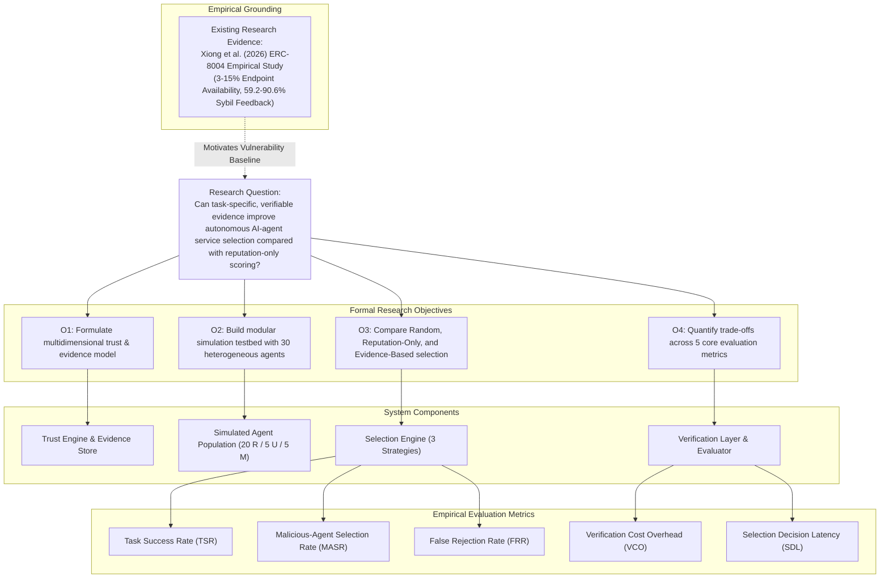

# Authoritative Documentation Directory

Welcome to the documentation suite for **Trust-Aware Service Selection for Autonomous AI Agents: An Evidence-Based Trust and Verification Framework**.

This repository serves four core functions simultaneously:
1. **Academic Research Specification**
2. **System Design & Software Blueprint**
3. **Team Handover & Presentation Guide**
4. **Open-Source GitHub Technical Documentation**

---

## 1. Complete Research Traceability Matrix

Every claim, component, and evaluation metric in this repository traces directly back to either **verified existing research evidence** or our **controlled experimental design**:



### Traceability Table

| Research Element | Question / Objective | System Component | Experimental Mechanism | Target Metric | Empirical Literature / Grounding | Conclusion / Claim Status |
|---|---|---|---|---|---|---|
| **Vulnerability to Sybil Inflation** | Why does reputation-only selection fail in decentralized markets? | Service Discovery & Selection Engine | Benchmark Strategy 2 (Reputation-Only) against Sybil rings | Malicious Selection Rate ($MASR$) | Xiong et al. (2026), arXiv:2606.26028 (59.2–90.6% Sybils in ERC-8004) | **VERIFIED EXISTING EVIDENCE**: Raw reputation collapses when Sybils are filtered. |
| **Domain-Specific Trust Grounding** | Does task-specific evidence outperform global ratings? | Trust Evaluation Engine & RAG Retriever | Strategy 3 (Evidence-Based) using vector domain similarity | Task Success Rate ($TSR$) | Sabater & Sierra (2002); Jøsang & Ismail (2002) | **PROPOSED MODEL**: To be empirically validated via simulation. |
| **Post-Execution Verification** | How do we detect behavioral drift and payload poisoning? | Result Verification Layer | Subprocess sandboxed unit testing and schema checks | Verification Cost ($VCO$) & $TSR$ | Anthropic MCP Specification (2024); PROV-AGENT (2025) | **IMPLEMENTED**: Automated sandbox test runners validate outputs. |
| **Tamper-Evident History** | How to prevent agents from deleting negative history? | Blockchain Provenance Module | SHA-256 Merkle root commitments anchored to smart contracts | Provenance Integrity | Merkle (1987); Zhu et al. (2026) | **IMPLEMENTED**: 32-byte roots anchored without heavy payload overhead. |

---

## 2. Directory Map & Reading Pathways

```text
docs/
├── 01-overview/             # What is the project?
│   ├── project-overview.md  # Executive summary, vision, and core concepts
│   ├── problem-statement.md # Failure modes in open agent ecosystems
│   ├── research-question.md # Formal research hypotheses and mathematical variables
│   ├── objectives.md        # Primary and secondary technical milestones
│   ├── scope.md             # In-scope boundaries vs. out-of-scope technologies
│   └── terminology.md       # Operational definitions (Trust vs. Reputation vs. Evidence)
│
├── 02-research/             # Academic foundation & literature
│   ├── literature-review.md # Detailed analysis of 6 verified papers
│   ├── research-gap.md      # Tabular and conceptual gap analysis
│   ├── research-basis.md    # Formal mathematical decision theory foundations
│   ├── existing-evidence.md # Verified findings from Xiong et al. (2026) on ERC-8004
│   ├── novelty-positioning.md# Measured contribution vs. prior art
│   ├── limitations.md       # Explicit assumptions and verifier boundaries
│   └── references.md        # Annotated bibliography of primary literature
│
├── 03-system-design/        # How does the framework work?
│   ├── system-context.md    # C4 context diagram and external boundaries
│   ├── architecture.md      # Comprehensive 10-component architecture
│   ├── component-design.md  # Detailed class and interface specifications
│   ├── trust-model.md       # Conceptual and proposed mathematical trust model
│   ├── evidence-model.md    # Lifecycle, JSON schemas, on-chain vs. off-chain
│   ├── service-selection.md # Objective formulation of the 3 selection strategies
│   ├── verification-model.md# Sandboxed testing, consensus, and cost trade-offs
│   ├── data-flow.md         # End-to-end data packet transformations
│   ├── sequence-diagrams.md # Protocol lifecycles (happy, unhappy, adversarial)
│   ├── threat-model.md      # Comprehensive analysis of 14 adversarial vectors
│   ├── security-model.md    # Cryptographic safeguards & Trust vs. Security
│   ├── privacy-model.md     # Sanitization, zero raw data on-chain
│   └── technology-roles.md  # Explicit roles for RAG, MCP, Blockchain, x402
│
├── 04-experiment/           # How will the hypothesis be tested?
│   ├── experimental-design.md# Controlled 30-agent testbed specification
│   ├── agent-population.md  # Operational profiles: 20 Reliable, 5 Unreliable, 5 Malicious
│   ├── task-generation.md   # Deterministic 100-task corpus across 5 domains
│   ├── selection-strategies.md# Algorithmic code definitions for all 3 strategies
│   ├── evaluation-metrics.md# Mathematical formulas for TSR, MASR, FRR, VCO, SDL
│   ├── experiment-protocol.md# Step-by-step trial execution and statistical testing
│   ├── reproducibility.md   # Deterministic replication instructions
│   └── results.md           # Formal result schemas [EXPERIMENT NOT YET RUN]
│
├── 05-implementation/       # Software implementation blueprints
│   ├── implementation-plan.md# 10-phase engineering roadmap and acceptance gates
│   ├── module-breakdown.md  # Python package layout across `src/`
│   ├── api-design.md        # REST and JSON-RPC endpoints [PROPOSED API]
│   ├── mcp-tools.md         # 5 tool declarations [PROPOSED MCP INTERFACE]
│   ├── rag-pipeline.md      # Vector indexing, relevance, and hallucination safeguards
│   ├── blockchain-integration.md# Gas analysis, Merkle batching, smart contract
│   ├── configuration.md     # Environment variables and YAML configuration
│   └── testing-strategy.md  # Unit, integration, system, and adversarial test suites
│
├── 06-presentation/         # Team presentation & defense assets
│   ├── team-handbook.md     # Complete A-to-W handbook for all team members
│   ├── 30-second-pitch.md   # High-impact 30s script
│   ├── 2-minute-explanation.md# Standard 2m pitch + 4 persona-tailored scripts
│   ├── 5-minute-presentation.md# Slide-by-slide 5m formal presentation
│   ├── architecture-explanation.md# Deep technical architecture for engineers
│   ├── methodology-explanation.md # Deep research methodology for professors
│   ├── judge-questions.md   # 50+ categorized questions with 5-part structure
│   ├── difficult-questions.md# Top 20 tough adversarial defenses
│   └── demo-script.md       # 9-step interactive terminal demonstration
│
├── 07-poster/               # Academic poster assets (1m × 1m format)
│   ├── poster-content.md    # Text and talking points for all 10 poster panels
│   ├── poster-layout.md     # 3-column layout, typography, and color palette
│   ├── evidence-mapping.md  # Traceability cross-reference from poster to repository
│   └── poster-evidence.md   # Visual empirical evidence talking points
│
└── 08-roadmap/              # Project progression & future directions
    ├── roadmap.md           # Strategic Gantt roadmap (Phases 1–10)
    ├── current-status.md    # Authoritative, transparent project status matrix
    ├── milestones.md        # Milestone deliverables and verification gates
    └── future-work.md       # x402 payments, zkML, and collaborative networks
```

---

## 3. Recommended Reading Pathways

- **For Judges & Evaluators (10 Minutes):**
  1. [`README.md`](../README.md)
  2. [`docs/01-overview/project-overview.md`](01-overview/project-overview.md)
  3. [`docs/02-research/existing-evidence.md`](02-research/existing-evidence.md)
  4. [`docs/06-presentation/30-second-pitch.md`](06-presentation/30-second-pitch.md)
  5. [`docs/06-presentation/difficult-questions.md`](06-presentation/difficult-questions.md)

- **For AI Researchers & Academics:**
  1. [`docs/01-overview/research-question.md`](01-overview/research-question.md)
  2. [`docs/02-research/literature-review.md`](02-research/literature-review.md)
  3. [`docs/02-research/novelty-positioning.md`](02-research/novelty-positioning.md)
  4. [`docs/04-experiment/experimental-design.md`](04-experiment/experimental-design.md)
  5. [`docs/04-experiment/evaluation-metrics.md`](04-experiment/evaluation-metrics.md)

- **For Software & Systems Engineers:**
  1. [`docs/03-system-design/architecture.md`](03-system-design/architecture.md)
  2. [`docs/03-system-design/component-design.md`](03-system-design/component-design.md)
  3. [`docs/05-implementation/mcp-tools.md`](05-implementation/mcp-tools.md)
  4. [`docs/05-implementation/testing-strategy.md`](05-implementation/testing-strategy.md)
  5. [`src/data_models.py`](../src/data_models.py)
